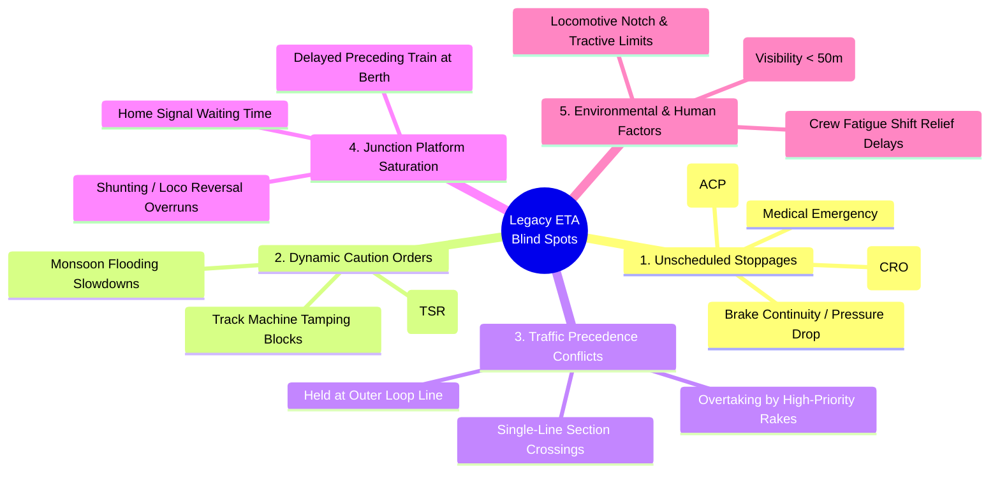
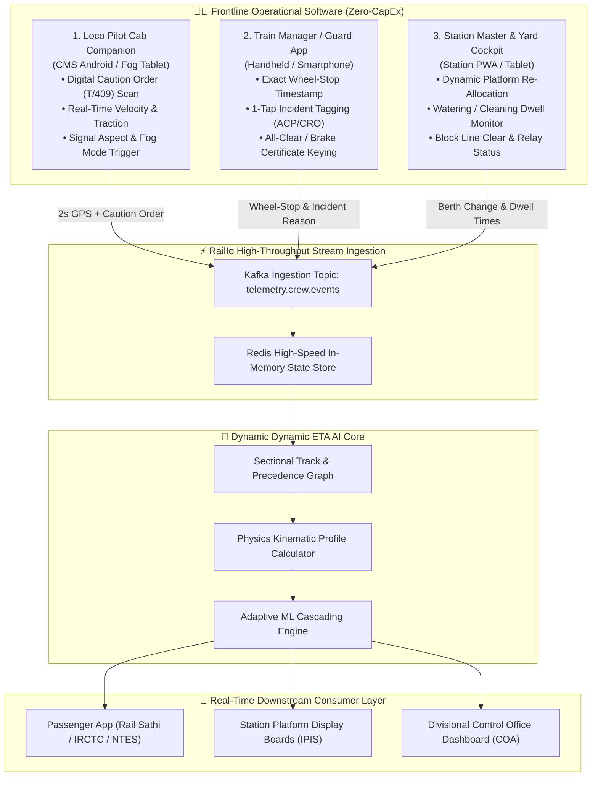
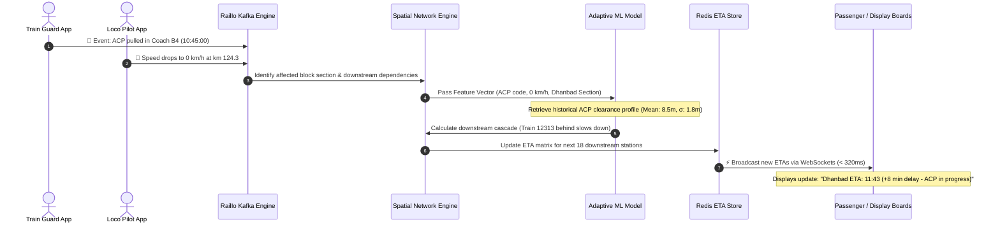
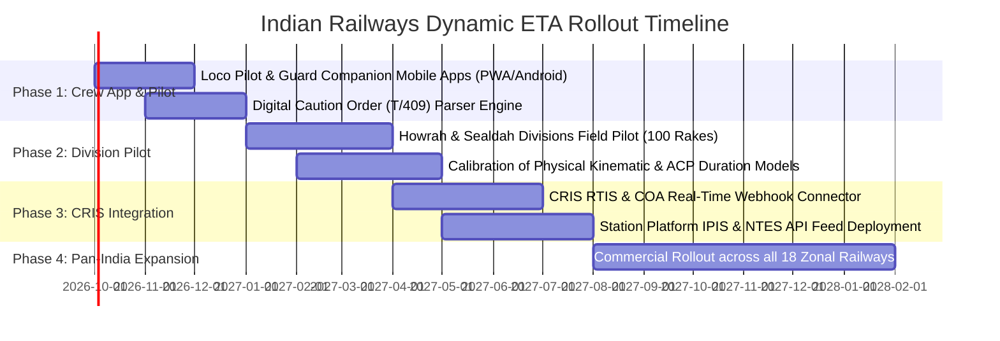

# 🚆 RailIo — Dynamic Ground-Truth ETA & Crew Telemetry Architecture Upgrade
## Next-Generation Data-Driven ETA Forecasting for Indian Railways (Coaching & Suburban)

> **Document Status:** Architectural Upgrade Proposal & Technical Implementation Blueprint  
> **Target Stakeholders:** Ministry of Railways, CRIS, RDSO, RailTel, IRCTC  
> **Platform:** RailIo (Rail Sathi Enterprise)  
> **Document Version:** 3.0 (Ground-Truth Dynamic ETA Edition)  
> **Scope:** 100% Software-Defined Telemetry, Mobile Crew Integration, Physics-Informed Kinematics & Adaptive ML Cascading

---

## 📋 Table of Contents
1. [Executive Summary & The Core Problem](#1-executive-summary--the-core-problem)
2. [The 5 Blind Spots of Legacy ETA Forecasting](#2-the-5-blind-spots-of-legacy-eta-forecasting)
3. [The 3-Persona Ground-Level Crew Software Ecosystem](#3-the-3-persona-ground-level-crew-software-ecosystem)
   - [3.1 Loco Pilot Cab Companion (CMS Integration)](#31-loco-pilot-cab-companion-cms-integration)
   - [3.2 Train Manager / Guard Companion](#32-train-manager--guard-companion)
   - [3.3 Station Master & Yard Master Cockpit](#33-station-master--yard-master-cockpit)
4. [Multi-Source Data Ingestion Matrix](#4-multi-source-data-ingestion-matrix)
5. [3-Tier Hybrid ETA Computation Engine](#5-3-tier-hybrid-eta-computation-engine)
   - [5.1 Physics-Informed Kinematic Trajectory Layer](#51-physics-informed-kinematic-trajectory-layer)
   - [5.2 Spatial Precedence & Network Headway Graph](#52-spatial-precedence--network-headway-graph)
   - [5.3 Adaptive Machine Learning Residual Delay Predictor](#53-adaptive-machine-learning-residual-delay-predictor)
6. [Mathematical Formulations & Algorithms](#6-mathematical-formulations--algorithms)
7. [Real-World Disruption Walkthrough (< 500ms Cascade)](#7-real-world-disruption-walkthrough--500ms-cascade)
8. [Production API Contracts & Data Schemas](#8-production-api-contracts--data-schemas)
9. [Zero-CapEx Implementation & Enterprise Migration Roadmap](#9-zero-capex-implementation--enterprise-migration-roadmap)

---

## 1. 🌟 Executive Summary & The Core Problem

Accurate forecasting of the **Expected Time of Arrival (ETA)** for coaching trains is critical to passenger satisfaction, platform management, crew turnaround scheduling, and multimodal logistics across Indian Railways (IR).

Currently, ETA predictions across public apps (NTES, IRCTC, commercial travel apps) rely on **static schedules, current instantaneous delay, and fixed in-built recovery margins**. When a train is delayed, legacy systems assume a linear extrapolation along the timetable.

### ❌ The Flaw in Existing Linear ETA:
$$\text{ETA}_{\text{legacy}}(S_{k}) = T_{\text{scheduled}}(S_{k}) + \text{Delay}_{\text{current}} - \text{StaticRecovery}(S_{k})$$

This model completely breaks down under real-world railway operating dynamics:
- It **does not know why** a train stopped in mid-section (Alarm Chain Pull vs Red Signal vs Track Obstruction).
- It **cannot account for upcoming Temporary Speed Restrictions (TSRs)** issued to the Loco Pilot on physical paper caution orders.
- It **ignores downstream track congestion**, such as loop-line stabling to give precedence to a higher-priority Rajdhani / Vande Bharat.
- It **fails to predict platform conflicts** at approaching terminal/junction stations.

### 🎯 The RailIo Solution
A **100% Software-Defined, Ground-Truth Dynamic ETA Engine** that directly equips **Loco Pilots, Guards, and Station Masters** with low-friction digital tools to stream live operational truth into a **Physics-Informed + Machine Learning Cascading Pipeline**.

```
┌──────────────────────────────────────────────────────────────────────────────────────────┐
│                             THE RAILIO REAL-TIME ADVANTAGE                               │
├───────────────────────────────┬──────────────────────────────────────────────────────────┤
│ Legacy ETA (Current Status)   │ ❌ 25–45 min error margin on long-distance journeys      │
│                               │ ❌ 30–60 min lag in detecting mid-section disruptions    │
│                               │ ❌ Static recovery assumptions                           │
├───────────────────────────────┼──────────────────────────────────────────────────────────┤
│ RailIo Dynamic Ground-Truth   │ ✅ ± 2–4 min precision across all downstream stations   │
│                               │ ✅ < 500ms event-driven ETA recalculation & broadcast    │
│                               │ ✅ Physics-informed kinematic + graph precedence ML      │
│                               │ ✅ ₹0 new trackside hardware (Pure software solution)    │
└───────────────────────────────┴──────────────────────────────────────────────────────────┘
```

---

## 2. ⚠️ The 5 Blind Spots of Legacy ETA Forecasting



---

## 3. 📱 The 3-Persona Ground-Level Crew Software Ecosystem

Rather than retrofitting expensive trackside sensors, RailIo taps directly into the frontline personnel who operate and manage the train using lightweight, offline-first mobile applications:



---

### 3.1 Loco Pilot Cab Companion (CMS Integration)
*Mounted in the locomotive cab (integrates with Indian Railways Crew Management System - CMS).*

1. **Digital Caution Order (T/409) Parser:**
   - At the beginning of a shift, the Loco Pilot receives a paper or digital Caution Order detailing all track speed restrictions.
   - The app scans the Caution Order QR code or syncs with the divisional server to automatically ingest exact kilometer-post boundaries:
     $$\text{TSR Segment: km 142/10 to 146/4} \implies \text{Max Speed: } 30\text{ km/h}$$
   - The ETA engine immediately injects this deceleration/acceleration curve into the physical running time model.
2. **One-Tap Signal & Environmental Overrides:**
   - `[🔴 Signal at Danger / Red]`
   - `[🟡 Caution / Aspect Yellow]`
   - `[🌫️ Fog Mode Active (< 50m Visibility — Max 60 km/h)]`
   - `[⚡ OHE Voltage Fluctuation]`
3. **High-Frequency Kinematic Telemetry:** Streams velocity, acceleration, and location every 2 seconds when network is available; auto-batches during remote cuttings.

---

### 3.2 Train Manager / Guard Companion
*Operates on the Train Manager's official Android mobile device.*

1. **Precision Wheel-Stop ($T_{\text{stop}}$) & Departure ($T_{\text{clear}}$) Logging:**
   - Captures the exact second the rake stops and restarts, distinguishing between scheduled platform dwell and mid-section signal/track halts.
2. **Instant Categorized Incident Tagging (3-Second Action):**
   - When a train halts unexpectedly, the Guard logs the ground cause with a single tap:
     - 🚨 **Alarm Chain Pulling (ACP):** Tag coach ID (e.g. `Coach S4`).
     - 🐄 **Cattle Run Over (CRO) / Track Obstruction.**
     - 🛑 **Brake Binding / Air Pressure Leakage.**
     - 🚑 **Passenger Medical Emergency.**
3. **Automated Incident Clearance Profiling:**
   - Each incident type immediately invokes a statistical clearance duration model (e.g., historical ACP reset duration in Eastern Railway = $8.5 \pm 1.8\text{ mins}$).
   - Downstream ETAs instantly adjust by $+8.5\text{ mins}$ without waiting for the train to start rolling again.

---

### 3.3 Station Master & Yard Master Cockpit
*A web-based PWA / tablet application for station cabins and yard offices.*

1. **Dynamic Platform Berthing & Conflict Resolution:**
   - If an incoming train is delayed and will occupy Platform 3 for an extra 20 minutes, the Station Master re-allocates the approaching following train to Platform 5.
   - The RailIo engine eliminates the 15-minute "Outer Signal Waiting Penalty" from the approaching train’s ETA.
2. **Station Dwell & Operational Readiness Counters:**
   - Tracks live progress of mandatory station operations:
     - Water filling status for coaching rakes.
     - Parcel and luggage loading/unloading volume.
     - Loco reversal & crew changeover time.
   - Dynamically forecasts departure timestamp rather than assuming static 5-minute dwell times.

---

## 4. 📊 Multi-Source Data Ingestion Matrix

| Data Stream | Primary Source | Protocol / Format | Update Frequency | Value Added to ETA |
| :--- | :--- | :--- | :--- | :--- |
| **Loco Pilot Caution Orders** | Driver App / CMS Server | JSON / QR Payload | Shift Start / On-demand | Exact TSR speed caps & track chainage |
| **Guard Incident Logs** | Train Manager App | HTTPS / WebSocket | Instant on event | Immediate categorization of unexpected halts |
| **Locomotive GPS & Speed** | ISRO NavIC RTIS + Driver App | MQTT / REST Webhook | Every 2–30 seconds | Continuous ground-truth velocity & distance |
| **Passenger Fused Telemetry** | RailIo Passenger Mobile SDK | Kafka Stream / TLS 1.3 | 5-second aggregate | Dense crowdsourced verification in cellular blind spots |
| **Signal & Dispatch Logs** | CRIS COA & NTES Event Bus | AMQP / Kafka Connect | Event-driven | Real-time block section occupancy & line clear |
| **Station Platform Allocation** | Station Master Cockpit | WebSocket / REST | Real-time on update | Eliminates outer home signal waiting surprises |
| **Weather & Visibility** | IMD Radar API / OpenWeather | REST JSON | 15-minute intervals | Fog & monsoon braking distance adjustments |

---

## 5. 🧠 3-Tier Hybrid ETA Computation Engine

```
┌─────────────────────────────────────────────────────────────────────────────┐
│                          3-TIER ETA HYBRID ENGINE                           │
├─────────────────────────────────────────────────────────────────────────────┤
│ 1. Physics-Informed Kinematics (Theoretical Maximum Performance Profile)    │
│    Calculates optimal run time based on locomotive tractive power, rake     │
│    mass, track gradient resistance, curves, and permanent/temporary speed   │
│    restrictions (PSR/TSR).                                                  │
├─────────────────────────────────────────────────────────────────────────────┤
│ 2. Spatial Network & Precedence Graph (Section Capacity & Headway)         │
│    Simulates downstream track blocks, preceding train spacing, single-line  │
│    crossings, and overtaking priorities at loop lines.                      │
├─────────────────────────────────────────────────────────────────────────────┤
│ 3. Adaptive ML Cascading Predictor (Statistical Residual Optimization)      │
│    Applies Gradient Boosted Decision Trees (XGBoost) and Graph Neural       │
│    Networks (GNN) trained on historical section performance, weather,       │
│    platform crowd density, and active crew incident tags.                   │
└─────────────────────────────────────────────────────────────────────────────┘
```

---

### 5.1 Physics-Informed Kinematic Trajectory Layer

The physical running time for any track segment $i$ of length $\Delta s_i$ is computed from fundamental train dynamics:

$$F_{\text{net}}(v) = F_{\text{tractive}}(v) - R_{\text{train}}(v) - R_{\text{gradient}}(\theta_i) - R_{\text{curve}}(r_i)$$

Where:
- **Davis Train Resistance Equation:**
  $$R_{\text{train}}(v) = A + B v + C v^2$$
  *(Constants $A, B, C$ calibrated for LHB rakes vs ICF coaching stock)*.
- **Gradient Resistance:** $R_{\text{gradient}} = M \cdot g \cdot \sin(\theta_i)$
- **Curve Resistance:** $R_{\text{curve}} = \frac{k}{r_i} \cdot M$
- **Segment Speed Limit:**
  $$v_{\text{limit}}(i) = \min\left(v_{\text{max\_loco}}, \ v_{\text{rake\_max}}, \ v_{\text{PSR}}(i), \ v_{\text{TSR\_caution}}(i), \ v_{\text{fog\_limit}}\right)$$

Kinematic segment time is then:
$$t_{\text{kinematic}}(i) = \int_{s_i}^{s_{i+1}} \frac{1}{v(s)} \, ds + t_{\text{accel\_decel}}(i)$$

---

### 5.2 Spatial Precedence & Network Headway Graph

Indian Railways tracks are divided into distinct block sections (Absolute Block or Automatic Signaling).

Let train $T_{\text{target}}$ follow preceding train $T_{\text{lead}}$ on section $i$:
$$\text{Earliest Entry Time}(T_{\text{target}}, i) = \max\left(\text{ArrivalTime}(T_{\text{target}}, i), \ \text{ClearanceTime}(T_{\text{lead}}, i) + t_{\text{block\_headway\_buffer}}\right)$$

#### 🚄 Precedence Hierarchy Logic:
When a lower-priority train (e.g., Express) is followed by a higher-priority train (e.g., Vande Bharat / Rajdhani) on a double-track route:
$$\text{If } \left( \text{ETA}(T_{\text{high}}, J) - \text{ETA}(T_{\text{low}}, J) \right) < \Delta t_{\text{overtake\_threshold}} \implies \text{Route } T_{\text{low}} \text{ to Loop Line at Junction } J$$
$$\implies \text{Apply Dynamic Loop Line Penalty: } D_{\text{loop}} = t_{\text{decel\_loop}} + t_{\text{dwell\_overtake}} + t_{\text{accel\_main}} \approx 18\text{ to } 30\text{ mins}$$

---

### 5.3 Adaptive Machine Learning Residual Delay Predictor

The final ETA combines physical kinematics, network graph constraints, and the ML residual model:

$$\mathbf{ETA}(S_{K}) = t_{\text{now}} + \sum_{i \in \text{path to } S_K} t_{\text{kinematic}}(i) + \sum_{j \in \text{intermediate stations}} D_{\text{dwell}}(j) + \sum_{b \in \text{blocks}} D_{\text{headway}}(b) + \hat{\Delta}_{\text{ML}}(\mathbf{X})$$

#### Feature Vector $\mathbf{X}$:
```python
feature_vector = [
    active_incident_code,          # e.g., ACP (0.85 weight), Signal Red (0.95 weight)
    incident_elapsed_time_minutes, # How long has the train been stopped
    caution_order_tsr_count,       # Number of active speed restrictions on path
    section_congestion_index,      # Ratio of current trains to track capacity
    destination_pf_conflict_flag, # 1 if assigned platform is currently blocked
    weather_visibility_meters,     # IMD / Fog-pass visibility sensor
    time_of_day_rush_factor,       # Peak suburban / terminal rush hour coefficient
    rake_type_recovery_score,      # WAP-7 + LHB (high) vs WAM-4 + ICF (low)
    historical_section_slack_used  # Fraction of timetable recovery time already consumed
]
```

---

## 6. 🧮 Mathematical Formulations & Algorithms



---

## 7. 🔄 Real-World Disruption Walkthrough (< 500ms Cascade)

### 📍 The Scenario:
**Train 12301 (Howrah - New Delhi Rajdhani Express)** halts in mid-section between **Asansol (ASN)** and **Dhanbad (DHN)** at Kilometer 218.4.

```
┌────────────────────────────────────────────────────────────────────────────────────────┐
│                          DISRUPTION EVENT CHRONOLOGY                                   │
├───────────┬────────────────────────────────────────────────────────────────────────────┤
│ T = 00:00 │ Train halts due to an Alarm Chain Pulling (ACP) in Coach B4.               │
├───────────┼────────────────────────────────────────────────────────────────────────────┤
│ T = 00:04 │ Train Guard selects [ACP] -> [Coach B4] on mobile app (5 seconds).         │
├───────────┼────────────────────────────────────────────────────────────────────────────┤
│ T = 00:05 │ Loco Pilot confirms Cab Brake Pipe pressure drop on Cab Companion.         │
├───────────┼────────────────────────────────────────────────────────────────────────────┤
│ T = 00:05.3│ RailIo Ingestion receives packet:                                         │
│           │ • Recovers historical ACP clearance model for Asansol Division (8.5 mins). │
│           │ • Evaluates following Train 12313 (6 km behind): Applies cautionary braking│
│           │   headway (+4 mins).                                                       │
│           │ • Checks Dhanbad Platform 2 allocation: Still valid within buffer.         │
├───────────┼────────────────────────────────────────────────────────────────────────────┤
│ T = 00:05.5│ All passenger apps, NTES, and Dhanbad station display boards update:       │
│           │ "Dhanbad Arrival: 11:43 (Delay: +8m | Reason: Alarm Chain Reset in Coach B4)│
├───────────┼────────────────────────────────────────────────────────────────────────────┤
│ T = 08:30 │ Guard resets valve; Loco Pilot sounds whistle and resumes speed.           │
│           │ System detects acceleration; ML recalculates recovery curve:               │
│           │ "Gaya Junction ETA: 14:32 (4 minutes recovered due to clear green path)."   │
└───────────┴────────────────────────────────────────────────────────────────────────────┘
```

---

## 8. 🛠️ Production API Contracts & Data Schemas

### 📥 1. Crew Incident Telemetry Ingestion
`POST /api/v1/telemetry/crew-event`

```json
{
  "train_number": "12301",
  "loco_id": "WAP7-30482",
  "reporter_role": "GUARD",
  "staff_id": "TM_ER_88412",
  "timestamp": "2026-09-12T10:55:00.000Z",
  "location": {
    "latitude": 23.6841,
    "longitude": 86.9622,
    "chainage_km": 218.4,
    "track_section_id": "ER-ASN-DHN-UP-02"
  },
  "event_type": "UNSCHEDULED_STOPPAGE",
  "incident_details": {
    "category": "ALARM_CHAIN_PULLING",
    "coach_number": "B4",
    "severity": "MEDIUM",
    "estimated_clearance_seconds": 510
  },
  "signal_aspect_observed": "GREEN"
}
```

---

### 📥 2. Digital Caution Order (T/409) Upload
`POST /api/v1/telemetry/caution-order`

```json
{
  "train_number": "12301",
  "division": "DHN",
  "issue_date": "2026-09-12",
  "speed_restrictions": [
    {
      "start_chainage_km": 142.5,
      "end_chainage_km": 146.2,
      "direction": "UP",
      "max_permissible_speed_kmh": 30,
      "reason": "TRACK_TAMPING_MAINTENANCE"
    },
    {
      "start_chainage_km": 188.0,
      "end_chainage_km": 190.5,
      "direction": "UP",
      "max_permissible_speed_kmh": 45,
      "reason": "BRIDGE_REPAIR"
    }
  ]
}
```

---

### 📤 3. Downstream High-Precision Dynamic ETA Output
`GET /api/v1/eta/dynamic/12301`

```json
{
  "train_number": "12301",
  "train_name": "Howrah - New Delhi Rajdhani Express",
  "last_computation_timestamp": "2026-09-12T10:55:01.320Z",
  "live_status": {
    "current_speed_kmh": 0,
    "active_incident": "Alarm Chain Pulling (Coach B4) - Reset in progress",
    "current_delay_minutes": 8.5,
    "confidence_score": 0.98
  },
  "downstream_stations": [
    {
      "station_code": "DHN",
      "station_name": "Dhanbad Junction",
      "distance_km": 42.5,
      "scheduled_arrival": "11:35:00",
      "dynamic_predicted_arrival": "11:43:30",
      "predicted_delay_minutes": 8.5,
      "platform_assigned": "PF 2 (Confirmed by SM Cabin)",
      "confidence_interval": "11:42 - 11:45"
    },
    {
      "station_code": "GAYA",
      "station_name": "Gaya Junction",
      "distance_km": 243.0,
      "scheduled_arrival": "14:28:00",
      "dynamic_predicted_arrival": "14:32:00",
      "predicted_delay_minutes": 4.0,
      "anticipated_recovery_minutes": 4.5,
      "confidence_interval": "14:30 - 14:34"
    },
    {
      "station_code": "NDLS",
      "station_name": "New Delhi",
      "distance_km": 1451.0,
      "scheduled_arrival": "05:55:00",
      "dynamic_predicted_arrival": "05:58:00",
      "predicted_delay_minutes": 3.0,
      "confidence_interval": "05:50 - 06:05"
    }
  ]
}
```

---

## 9. 🚀 Zero-CapEx Implementation & Enterprise Migration Roadmap



---

## 🏁 Conclusion

By equipping **Loco Pilots, Guards, and Station Masters** with low-friction, high-value mobile tools that stream ground realities the instant they occur, **RailIo transforms Indian Railways' ETA system from a static, lagging guess into an intelligent, sub-second predictive platform**. 

This pure-software innovation requires **zero new trackside hardware CapEx**, safeguards passenger trust, streamlines platform utilization, and establishes a world-class standard for modern railway operations.
