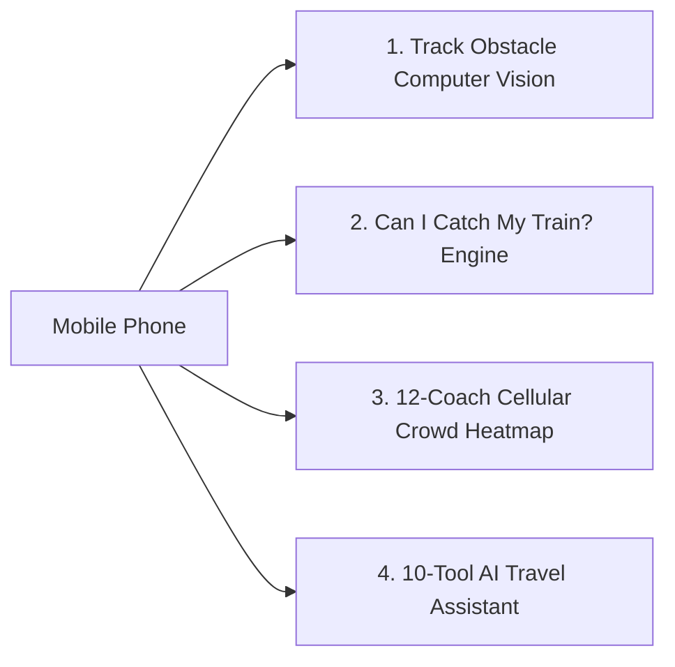
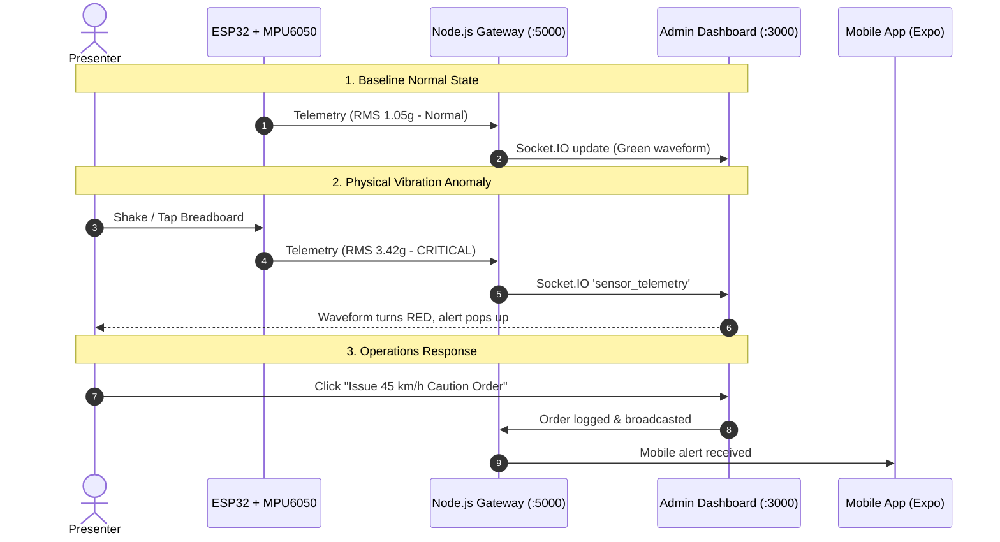

# 🚆 RailIo: Hardware Assembly & Full Demo Setup Guide

> **Predict • Protect • Connect**  
> Complete manual for assembling **ESP32 + MPU6050** on a breadboard, connecting to the RailIo IoT Gateway, running the **Mobile App with Edge Computer Vision**, and executing a live demonstration.

---

## 📋 Table of Contents
1. [🧰 Hardware Requirements](#1--hardware-requirements)
2. [🔌 Breadboard Pin-to-Pin Wiring Diagram](#2--breadboard-pin-to-pin-wiring-diagram)
3. [🧪 Step 1: I2C Hardware Sanity Check](#3--step-1-i2c-hardware-sanity-check)
4. [⚡ Step 2: Flash the RailIo IoT Telemetry Firmware](#4--step-2-flash-the-railio-iot-telemetry-firmware)
5. [🚀 Step 3: Launch the Full Project Ecosystem](#5--step-3-launch-the-full-project-ecosystem)
6. [📱 Step 4: Connect Your Mobile Phone (Mobile GPU & Vision Demo)](#6--step-4-connect-your-mobile-phone-mobile-gpu--vision-demo)
7. [🎬 Step 5: Interactive Live Demo Presentation Script](#7--step-5-interactive-live-demo-presentation-script)
8. [🛠️ Troubleshooting & FAQ](#8-️-troubleshooting--faq)

---

## 1. 🧰 Hardware Requirements

| Item | Component | Details / Specifications |
| :--- | :--- | :--- |
| **1** | **ESP32 Dev Module** | 30-pin or 38-pin DevKit V1 with built-in Wi-Fi & Bluetooth |
| **2** | **MPU-6050 IMU Module** | GY-521 breakout board (3-axis accelerometer + 3-axis gyroscope) |
| **3** | **Solderless Breadboard** | 400 or 830 tie-points |
| **4** | **Jumper Wires** | 4x Male-to-Male or Male-to-Female jumper wires |
| **5** | **Micro-USB Cable** | Data cable for programming and powering the ESP32 |
| **6** | **Smartphone** | Android or iOS device with camera & GPU support for Expo Go |
| **7** | *(Optional)* **LED & Resistor** | 5mm LED on GPIO 2 (or use onboard blue LED) |
| **8** | *(Optional)* **Piezo Buzzer** | 5V active buzzer on GPIO 4 for audible track anomaly alerts |

---

## 2. 🔌 Breadboard Pin-to-Pin Wiring Diagram

### 📌 Wiring Connections Table

| MPU6050 (GY-521) Pin | ESP32 Dev Board Pin | Wire Color Recommendation | Description / Function |
| :--- | :--- | :--- | :--- |
| **VCC** | **3V3 (or 3.3V)** | 🔴 Red | 3.3V Power Supply (*Logic-safe for ESP32*) |
| **GND** | **GND** | ⚫ Black | Ground Reference |
| **SCL** | **GPIO 22** | 🟡 Yellow | I2C Serial Clock Line |
| **SDA** | **GPIO 21** | 🟢 Green | I2C Serial Data Line |
| **AD0** | *Unconnected / GND* | — | Sets I2C address to `0x68` (Default) |
| **INT / XDA / XCL** | *Unconnected* | — | Not needed for standard polling mode |

```
                       ┌───────────────────────────────┐
                       │         ESP32 DevKit          │
                       │                               │
               [ 3V3 ]─┴──────────┐                    │
               [ GND ]─────────┐  │                    │
               [GPIO21]────┐   │  │                    │
               [GPIO22]─┐  │   │  │                    │
                       │  │   │  │                    │
                       │  │   │  │    BREADBOARD      │
                       │  │   │  │   ┌─────────────┐  │
                       └──┼───┼──┼───┤ SCL         │  │
                          └───┼──┼───┤ SDA  MPU6050│  │
                              └──┼───┤ GND (GY-521)│  │
                                 └───┤ VCC         │  │
                                     └─────────────┘  │
```

> [!TIP]
> **Breadboard Best Practice:** Mount the ESP32 straddling the middle bridge channel of the breadboard so pins on both sides remain accessible.

---

## 3. 🧪 Step 1: I2C Hardware Sanity Check

Before running the full telemetry firmware, run the lightweight diagnostic scanner to verify that the ESP32 can communicate with the MPU6050 over the I2C bus.

1. Connect your ESP32 to your PC via USB.
2. Open **Arduino IDE**.
3. Select your Board: `Tools` $\rightarrow$ `Board` $\rightarrow$ `esp32` $\rightarrow$ **ESP32 Dev Module**.
4. Select your Port: `Tools` $\rightarrow$ `Port` $\rightarrow$ **COMx** (e.g., COM3, COM4).
5. Open the diagnostic sketch located at:
   `iot/esp32/i2c_scanner.ino`
6. Click **Upload** ($\rightarrow$).
7. Open **Serial Monitor** (`Ctrl + Shift + M`) and set baud rate to **115200**.
8. **Expected Output:**
   ```text
   =======================================================
   🚆 RailIo - ESP32 I2C Hardware Bus Diagnostic
   =======================================================
   Configuring I2C Pins: SDA = GPIO 21 | SCL = GPIO 22

   [Scanning I2C Bus for MPU6050...]
   ✅ SUCCESS: I2C device found at 7-bit hex address: 0x68
      -> Target Recognized: MPU6050 6-Axis IMU (Standard 0x68 Address)
      -> Status: READY for RailIo Firmware!
   ```

---

## 4. ⚡ Step 2: Flash the RailIo IoT Telemetry Firmware

### 4.1 Install Required Arduino Libraries
1. In Arduino IDE, open **Tools $\rightarrow$ Manage Libraries...**
2. Search for **ArduinoJson** (by Benoît Blanchon).
3. Click **Install** (v6 or v7 supported).

### 4.2 Find Your Computer's Local IP Address
Your ESP32 and PC must be on the same local Wi-Fi or Mobile Hotspot.
1. Open PowerShell or Command Prompt on your PC and run:
   ```cmd
   ipconfig
   ```
2. Look for **IPv4 Address** under your active Wi-Fi adapter (e.g., `192.168.1.15` or `192.168.43.50`).

### 4.3 Configure & Upload Firmware
1. Open the main firmware sketch:
   `iot/esp32/esp32_mpu6050_track_sensor.ino`
2. Update **Lines 34–40** with your Wi-Fi credentials and PC IP:
   ```cpp
   // 1. Wi-Fi Credentials (or your Mobile Hotspot)
   const char* WIFI_SSID = "YOUR_WIFI_OR_HOTSPOT_NAME";
   const char* WIFI_PASS = "YOUR_WIFI_PASSWORD";

   // 2. Your PC's Local IP running RailIo Backend
   const char* SERVER_URL = "http://192.168.1.15:5000/api/track/sensor";
   ```
3. Click **Upload** ($\rightarrow$).
4. Open the **Serial Monitor** at **115200 baud** to see real-time G-force telemetry transmission:
   ```text
   ✅ [Network] Wi-Fi Connected! IP: 192.168.1.105
   🟢 [NORMAL TRACK] Section: HWH-B17 | RMS: 1.04g (ax: 0.05, ay: -0.02, az: 1.02)
   ```

---

## 5. 🚀 Step 3: Launch the Full Project Ecosystem

Launch all 4 RailIo microservices concurrently with a single command.

### In PowerShell:
```powershell
cd c:\Users\dassh\Project\railio
.\scripts\start-dev.ps1
```

### Or in Command Prompt:
```cmd
cd c:\Users\dassh\Project\railio
scripts\start-dev.bat
```

### 🌐 Microservice Port & Endpoint Map:

| Service | Port / URL | Purpose |
| :--- | :--- | :--- |
| **Node.js Gateway & Simulation** | `http://localhost:5000` | Ingests ESP32 telemetry, maintains in-memory state, broadcasts WebSockets |
| **Admin Operations Dashboard** | `http://localhost:3000` | Real-time SVG track map, vibration waveforms, digital twin dispatch |
| **FastAPI AI Microservice** | `http://localhost:8000` | XGBoost delay models, XAI SHAP attribution, RAG agent (`/docs`) |
| **React Native Metro Bundler** | `http://localhost:8081` | Serves mobile app bundle with Expo QR code |

---

## 6. 📱 Step 4: Connect Your Mobile Phone (Mobile GPU & Vision Demo)

### 📲 Running on Your Phone:
1. Connect your phone to the **same Wi-Fi or Mobile Hotspot** as your PC.
2. Install **Expo Go** from Google Play Store (Android) or Apple App Store (iOS).
3. Open **Expo Go** $\rightarrow$ Tap **Scan QR code** $\rightarrow$ Scan the QR code in your terminal.

---

### 🌟 Key Mobile Features Ready for Demo:



1. **Smartphone Track Obstacle Vision (`ObstacleDetectionScreen.tsx`)**:
   - Uses mobile camera viewport + edge computer vision simulation.
   - Interactive scenarios:
     - **Person Intrusion (Critical)**: Bounding box tracking with emergency brake trigger.
     - **Cattle Hazard (High Risk)**: Trackside warning with 60 km/h caution order advisory.
     - **Clear Track (Normal)**: High-speed 130 km/h green track verification.
2. **"Can I Catch My Train?" Decision Engine (`CanICatchScreen.tsx`)**:
   - Computes boardability probability based on live train ETA, road traffic congestion multipliers, and platform walking/security dwell times.
3. **Suburban Local Cellular Heatmap (`SuburbanLocalScreen.tsx`)**:
   - Google Maps-style cellular device pulse across 12 EMU coaches (Dakshineswar $\rightarrow$ Sealdah / Howrah).
4. **AI Travel Assistant ("RailIo Sathi") (`AIAssistantScreen.tsx`)**:
   - Conversational assistant with multi-tool routing and Indian Railways rules.

---

## 7. 🎬 Step 5: Interactive Live Demo Presentation Script

Follow this step-by-step presentation script:



1. **Demonstrate Normal State:**
   - Place the breadboard flat on your desk.
   - Open **Admin Dashboard** (`http://localhost:3000`) $\rightarrow$ Click the **Track Health & Vibration** tab.
   - Show the live green RMS waveform oscillating normally between **1.0g and 1.2g** with a Track Health Score of **~90%**.
2. **Demonstrate Real-Time Anomaly Detection:**
   - Tap or shake the breadboard vigorously to simulate a train encountering a track joint defect or ballast void.
   - Observe the ESP32 Serial Monitor print:
     `🚨 [CRITICAL ANOMALY] Section: HWH-B17 | RMS: 3.42g`
   - Watch the Admin Dashboard waveform instantly spike to **RED (>3.2g)** in real time!
3. **Issue Dispatcher Caution Order:**
   - On the Admin Web screen, click **"Issue 45 km/h Caution Order"**.
   - The caution banner activates and logs the operational speed restriction.
4. **Demonstrate Mobile Computer Vision & Passenger Features:**
   - Open the **Mobile App** on your phone.
   - Showcase **Smartphone Obstacle Detection** with the 3 camera scenarios.
   - Showcase the **"Can I Catch My Train?"** multi-factor calculation.

---

## 8. 🛠️ Troubleshooting & FAQ

### Q: The ESP32 cannot connect to Wi-Fi.
- Ensure you are connecting to a **2.4 GHz Wi-Fi network** (ESP32 does not support 5 GHz Wi-Fi).
- If using a Mobile Hotspot, configure the Hotspot AP Band to **2.4 GHz Band**.

### Q: The Serial Monitor says `MPU-6050 NOT responding (Error code: 2)`.
- Check breadboard connections:
  - Is **SDA** connected to **GPIO 21**?
  - Is **SCL** connected to **GPIO 22**?
  - Is **VCC** connected to **3.3V** and **GND** to **GND**?
- Press all jumper wires firmly into the breadboard tie-points.

### Q: The ESP32 connects to Wi-Fi but returns `HTTP POST Failed: connection refused`.
- Verify your PC's IP address by running `ipconfig` in PowerShell.
- Ensure the RailIo backend is running on port 5000 (`http://localhost:5000`).
- If Windows Firewall blocks incoming connections, allow Node.js through private networks.
