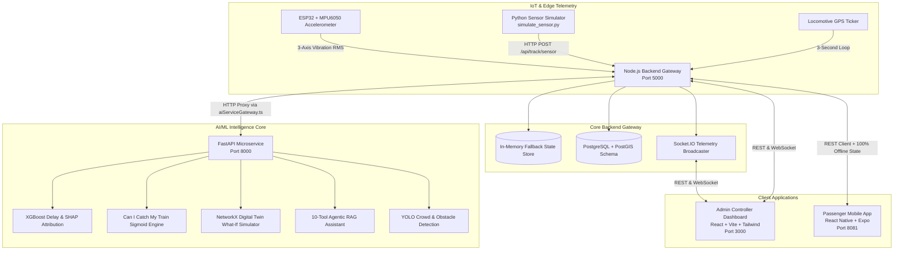

# 🚆 RailSathi (Smart Rail AI) — Implementation & Developer Handover Guide

> **Tagline:** *Predict • Protect • Connect*  
> **Repository:** `shibashisdas76/RailSathi`  
> **Core Purpose:** End-to-end intelligent railway operations and passenger assistance platform bridging high-frequency telemetry (ESP32 IoT track sensors, locomotive GPS, CCTV streams) with AI/ML decision engines, a Dispatcher Digital Twin, and the hero **"Can I Catch My Train?"** multi-factor calculator.

---

## 1. 🏗️ High-Level System Architecture

RailSathi is organized as a **hybrid monorepo** featuring 4 concurrently executing services, plus IoT edge firmware and a spatial database schema.



---

## 2. 🧰 Tech Stack Breakdown & Package Manager Comparison

### 2.1 Technology Matrix

| Layer | Primary Framework / Runtime | Key Libraries & Tools | Default Port |
| :--- | :--- | :--- | :---: |
| **Backend Gateway** | Node.js (v18+) + TypeScript 5.7 | Express 4.21, Socket.IO 4.8, Axios 1.7, JWT, Bcryptjs, UUID, ts-node | `5000` |
| **AI / ML Microservice** | Python 3.10+ / FastAPI 0.115 | Uvicorn, Scikit-learn 1.6, NetworkX 3.4, NumPy 2.2, Pydantic v2, HTTPX | `8000` |
| **Admin Web Dashboard** | React 18.3 + TypeScript + Vite 6 | Tailwind CSS 3.4, Lucide React, Recharts 2.15, Leaflet & React-Leaflet, Socket.IO Client | `3000` |
| **Passenger Mobile App** | React Native 0.81.5 + Expo SDK 54 | React 19, TypeScript 5.3, React Navigation (v6 Stack & Bottom Tabs), Lucide React Native, Expo Linear Gradient, React Native SVG, Socket.IO Client | `8081` |
| **IoT / Edge Hardware** | C++ (Arduino ESP32 core) & Python 3 | ESP32 DevKit, MPU6050 6-DoF IMU, Requests, Math / RMS filters | Edge / Serial |
| **Database Layer** | PostgreSQL 16 + PostGIS extension | Spatial Point indexing (`ST_SetSRID`), JSONB for coach composition and SHAP logs | `5432` |

---

### 2.2 📦 Package Manager: `npm` vs `bun` (Compatibility & Usage)

#### 🔹 Default Configuration: `npm`
The workspace is configured with standard `package.json` scripts across `backend/`, `admin-web/`, and `mobile/` using `npm` and `npx`:
- **Backend dev**: `npm run dev` (executes `ts-node src/server.ts`)
- **Admin Web dev**: `npm run dev` (executes `vite`)
- **Mobile dev**: `npx expo start -c` (Expo Metro Bundler)

#### 🔹 Can you use **Bun**?
**Yes!** Bun is supported with the following component guidelines:

| Subproject | Bun Compatibility | Recommendation & Notes |
| :--- | :---: | :--- |
| **`backend/`** | ✅ **100% Compatible** | You can run `bun install` and `bun run dev` (or `bun src/server.ts` directly without `ts-node`). Bun natively executes TypeScript and loads `.env` variables automatically. |
| **`admin-web/`** | ✅ **100% Compatible** | You can run `bun install` and `bun run dev` (Vite dev server starts instantly with Bun). |
| **`mobile/`** | ⚠️ **Use `bun` for install, `npx` for runtime** | `bun install` works fast in `mobile/`. However, React Native / Expo Metro bundler relies on Node runtime resolution for some React Native SVG and native Babel modules. Launch via `npx expo start` to avoid Metro resolution issues. |
| **`ai-service/`** | 🐍 **Python (`pip` / `uv`)** | AI service uses Python. Use `pip install -r requirements.txt` or `uv pip install -r requirements.txt`. |

---

## 3. 📁 Monorepo Directory Structure

```
railsathi/
├── ai-service/                          # 🧠 FastAPI AI/ML Microservice (Port 8000)
│   ├── app/
│   │   ├── agent/                      # 10-Tool Agentic AI Router (rail_agent.py)
│   │   ├── cv/                         # YOLO Platform Crowd & Obstacle Detection
│   │   ├── digital_twin/               # NetworkX Topological Graph Simulator
│   │   ├── iot/                        # Track Vibration Anomaly & RMS Deterioration Detector
│   │   ├── ml/                         # XGBoost Delay & "Can I Catch My Train?" Engine
│   │   ├── rag/                        # IRCTC / Indian Railways Rulebook Knowledge Base
│   │   ├── api/endpoints.py            # REST Router for all ML/CV/IoT/Twin endpoints
│   │   └── main.py                     # FastAPI entrypoint & CORS middleware
│   ├── tests/test_ai_services.py       # Automated unit test suite for all AI modules
│   └── requirements.txt
│
├── backend/                             # 🚀 Node.js Gateway & Simulation Engine (Port 5000)
│   ├── src/
│   │   ├── controllers/                # Handlers: auth, train, station, catch, track, twin, crowd, etc.
│   │   ├── models/                     # In-Memory thread-safe data store + fallback records
│   │   ├── routes/api.ts               # Express 60+ endpoint REST router
│   │   ├── services/
│   │   │   ├── simulationEngine.ts     # 3-Second GPS & live speed recalculation ticker
│   │   │   ├── aiServiceGateway.ts     # Resilient Axios proxy to FastAPI with automatic fallback
│   │   │   └── communicationChannel.ts # Notification & WhatsApp omnichannel dispatcher
│   │   ├── server.ts                   # Express app initialization + Socket.IO server
│   │   └── __tests__/api.test.ts       # Backend REST automated test suite
│   ├── package.json
│   └── tsconfig.json
│
├── admin-web/                           # 🎛️ Controller Operations Dashboard (Port 3000)
│   ├── src/
│   │   ├── components/
│   │   │   ├── LiveRailwayMap.tsx      # SVG Interactive Corridor Map with live GPS trains
│   │   │   ├── DigitalTwinStudio.tsx   # What-If Precedence Dispatcher Simulator
│   │   │   ├── TrackHealthMonitor.tsx  # ESP32 RMS vibration & 4-day deterioration charts
│   │   │   ├── DelayPropagationTree.tsx# Cascading delay tree visualization
│   │   │   ├── CrowdHeatmaps.tsx       # Station platform density heatmaps
│   │   │   ├── AlertsManager.tsx       # System-wide alert broadcasting
│   │   │   ├── KPICards.tsx            # Punctuality, Active Rakes, Track Risk metrics
│   │   │   └── Navbar.tsx              # Top status bar & view switcher
│   │   ├── App.tsx                     # Main Dashboard Layout
│   │   ├── index.css                   # Custom Tailwind design tokens & dark mode
│   │   └── vite.config.ts
│   └── package.json
│
├── mobile/                              # 📱 Passenger Mobile App (Strictly React Native)
│   ├── src/
│   │   ├── screens/                    # 22 Screens: CanICatch, SuburbanLocal, LiveTrain, AI Sathi, etc.
│   │   ├── components/                 # VandeBharatHero SVG, TrainCard, Custom Headers
│   │   ├── navigation/                 # RootStack & BottomTab Navigators
│   │   ├── services/api.ts             # API Client with 100% Offline fallback data
│   │   └── types/index.ts              # TypeScript domain types & interfaces
│   ├── App.tsx                         # Expo Entrypoint
│   └── package.json
│
├── iot/                                 # 📡 IoT Edge Firmware & Telemetry Generator
│   ├── esp32/esp32_firmware.ino        # Arduino C++ sketch for ESP32 + MPU6050 6-DoF IMU
│   └── simulate_sensor.py              # Standalone Python telemetry streamer CLI
│
├── database/                            # 🗄️ Database Schemas & Migrations
│   ├── schema.sql                      # PostgreSQL + PostGIS spatial tables
│   └── seed/seedData.json              # 20+ realistic train and station profiles
│
└── scripts/                             # ⚡ 1-Click Startup Automation
    ├── start-dev.ps1                   # Windows PowerShell Concurrent Launcher
    ├── start-dev.bat                   # Windows CMD Launcher
    └── start-dev.sh                    # Linux / macOS Bash Launcher
```

---

## 4. 📱 Mobile App — 22 Screens Inventory

| Screen File | Feature Description |
| :--- | :--- |
| `HomeScreen.tsx` | Vande Bharat hero SVG + Quick search card + Bottom navigation hub |
| `SearchTrainScreen.tsx` | Train number / name search with auto-suggestions |
| `SearchResultsScreen.tsx` | Filtered train search results list |
| `TrainDetailsScreen.tsx` | Train route stops, coach classes, and XAI delay factor breakdown |
| `LiveTrainScreen.tsx` | Real-time GPS tracking with speed and next-station ETA |
| `CanICatchScreen.tsx` | **HERO:** Multi-factor road + security + train delay catch probability |
| `StationArrivalBoardScreen.tsx` | Real-time arrivals & departures board for any station |
| `AIAssistantScreen.tsx` | 10-Tool Agentic AI chat with live tool execution badges |
| `CoachCrowdScreen.tsx` | Coach-by-coach occupancy density heatmap with warning badges |
| `CrowdStatusScreen.tsx` | Platform crowd density overview for selected stations |
| `SuburbanLocalScreen.tsx` | Kolkata & Mumbai suburban timetables + cellular crowd density |
| `ObstacleDetectionScreen.tsx` | YOLO computer vision track obstacle & intrusion detection feed |
| `WeatherIntelligenceScreen.tsx` | Weather alerts, rainfall precautionary speed limits, and fog index |
| `WhatsAppSimulatorScreen.tsx` | WhatsApp-style conversational chat view mirroring the bot |
| `AlertsScreen.tsx` | System-wide railway operational alerts feed |
| `ConnectingTrainScreen.tsx` | Smart alternative connecting train recommendations |
| `AdminQuickAlertsScreen.tsx` | Emergency alert composer for railway controllers |
| `LoginScreen.tsx` | JWT authentication screen |
| `RegisterScreen.tsx` | Passenger registration screen |
| `ProfileScreen.tsx` | User profile & travel history |
| `SettingsScreen.tsx` | Theme, notification, and language configuration |
| `SplashScreen.tsx` | Animated startup splash screen |

---

## 5. 🧠 AI/ML Service — FastAPI Endpoint Map

All routes are prefixed with `/api` and defined in `ai-service/app/api/endpoints.py`:

| Endpoint | Method | Python Module | Description |
| :--- | :---: | :--- | :--- |
| `/ml/predict-delay` | `POST` | `eta_delay_predictor.py` | XGBoost ETA & SHAP delay factor attribution |
| `/ml/catch-probability` | `POST` | `catch_probability.py` | Sigmoid "Can I Catch?" probability engine |
| `/cv/crowd/platform/{station}/{platform}` | `GET` | `crowd_detector.py` | YOLO platform crowd analysis |
| `/cv/obstacle/detect` | `POST` | `obstacle_detector.py` | Track obstacle & intrusion detection |
| `/iot/anomaly` | `POST` | `anomaly_detector.py` | ESP32 RMS vibration thresholding & anomaly check |
| `/digital-twin/simulate` | `POST` | `network_twin.py` | NetworkX What-If dispatcher precedence simulation |
| `/agent/chat` | `POST` | `rail_agent.py` | 10-Tool Agentic RAG passenger assistant |
| `/health` | `GET` | `main.py` | Microservice health check |

---

## 6. 🚀 Backend REST API — Route Reference

All routes are served at `http://localhost:5000/api` and mapped in `backend/src/routes/api.ts`:

| Route | Method | Controller | Description |
| :--- | :---: | :--- | :--- |
| `/auth/login` | `POST` | `authController` | JWT authentication |
| `/auth/register` | `POST` | `authController` | New user registration |
| `/trains` | `GET` | `trainController` | List all active trains |
| `/trains/:trainNumber` | `GET` | `trainController` | Get single train details |
| `/trains/:trainNumber/live` | `GET` | `trainController` | Live GPS coordinates, speed, delay |
| `/trains/:trainNumber/eta` | `GET` | `trainController` | AI-predicted arrival ETA |
| `/stations` | `GET` | `stationController` | List all railway stations |
| `/stations/:id/arrivals` | `GET` | `stationController` | Station live arrival board |
| `/catch-probability` | `POST` | `catchController` | **HERO:** Calculate Can I Catch probability |
| `/crowd/station/:id` | `GET` | `crowdController` | Station platform crowd level |
| `/crowd/train/:trainNumber` | `GET` | `crowdController` | Coach-by-coach crowding density |
| `/suburban/upcoming` | `GET` | `suburbanController` | Upcoming suburban local trains |
| `/suburban/crowd-telemetry/:trainNumber` | `GET` | `suburbanController` | Coach cellular signal crowd telemetry |
| `/suburban/corridors` | `GET` | `suburbanController` | Available suburban corridors |
| `/track/risk` | `GET` | `trackController` | Track vibration health & risk scores |
| `/track/telemetry/history` | `GET` | `trackController` | Historical RMS vibration data |
| `/track/sensor` | `POST` | `trackController` | Ingest real-time ESP32 accelerometer data |
| `/digital-twin/simulate` | `POST` | `digitalTwinController` | Run What-If dispatch simulation |
| `/ai/chat` | `POST` | `aiController` | 10-Tool AI assistant chat |
| `/ai/whatsapp-webhook` | `POST` | `aiController` | WhatsApp omnichannel webhook |
| `/weather` | `GET` | `adminController` | Weather intelligence & speed alerts |
| `/admin/dashboard` | `GET` | `adminController` | Operational KPI metrics overview |
| `/admin/alerts` | `GET` / `POST` | `adminController` | Retrieve or broadcast operational alerts |

---

## 7. 🎯 Core Algorithms & Mathematical Formulations

### 7.1 Hero Feature: "Can I Catch My Train?"
- **File:** `ai-service/app/ml/catch_probability.py`
- **Math Formula:**
  $$\text{Available Margin (min)} = (\text{Scheduled Departure} + \text{Live Delay}) - (\text{Road Distance} \times \text{Traffic Multiplier} + \text{Station Entry Buffer} + \text{Safety Buffer})$$
  $$\text{Traffic Multipliers}: \text{LOW}=1.0,\; \text{MODERATE}=1.4,\; \text{HEAVY}=1.85,\; \text{SEVERE}=2.5$$
  $$\text{Catch Probability \%} = \frac{100}{1 + e^{-k \times (\text{Margin} - \text{Midpoint})}}$$

### 7.2 IoT Track Vibration & RMS Metric
- **File:** `ai-service/app/iot/anomaly_detector.py`
- **Vibration Formula:**
  $$\text{RMS} = \sqrt{a_x^2 + a_y^2 + a_z^2}$$
- **Thresholds:**
  - $\text{RMS} < 2.0\text{g} \rightarrow \text{NORMAL (Green)}$
  - $2.0\text{g} \le \text{RMS} \le 3.2\text{g} \rightarrow \text{WARNING (Yellow)}$
  - $\text{RMS} > 3.3\text{g} \rightarrow \text{CRITICAL EMERGENCY (Red)}$

---

## 8. 🛡️ Resilience & 100% Offline Demo Mode

RailSathi implements a **three-tier fallback architecture** to ensure zero demo crashes:

1. **Frontend Offline Fallback**: `mobile/src/services/api.ts` contains static seed data for all trains (`22436 Vande Bharat`, `12301 Rajdhani`, `12004 Shatabdi`, etc.), station boards, coach crowd heatmaps, and weather alerts.
2. **Backend AI Proxy Fallback**: `backend/src/services/aiServiceGateway.ts` forwards requests to FastAPI (`http://localhost:8000/api`). If the Python microservice is offline, the backend calculates algorithmic fallbacks for delay predictions and catch probabilities.
3. **In-Memory State Store**: `backend/src/models/dataStore.ts` maintains in-memory railway state at boot, eliminating the need for a live PostgreSQL instance during local development.

---

## 9. 🚀 Setup & Execution Guide

### Prerequisites
- **Node.js**: v18+ (tested on v22)
- **Python**: v3.10+
- **Package Manager**: `npm` (or `bun`)
- **Git**

---

### Option A: One-Command All-in-One Launcher

#### Windows PowerShell:
```powershell
.\scripts\start-dev.ps1
```

#### Windows Command Prompt:
```cmd
.\scripts\start-dev.bat
```

#### Linux / macOS:
```bash
chmod +x ./scripts/start-dev.sh
./scripts/start-dev.sh
```

---

### Option B: Running Services Manually (4 Terminals)

#### Terminal 1 — FastAPI AI Microservice (Port 8000)
```bash
cd ai-service
pip install -r requirements.txt
python -m uvicorn app.main:app --port 8000 --reload
```
*Docs: `http://localhost:8000/docs`*

#### Terminal 2 — Node.js Backend Gateway (Port 5000)
```bash
cd backend
npm install
npm run dev
```
*API Gateway: `http://localhost:5000/api`*

#### Terminal 3 — Admin Controller Dashboard (Port 3000)
```bash
cd admin-web
npm install
npm run dev
```
*Dashboard: `http://localhost:3000`*

#### Terminal 4 — Passenger Mobile App (Port 8081)
```bash
cd mobile
npm install
npx expo start -c
```
- Press **`w`** for browser preview: `http://localhost:8081`
- Scan QR code with **Expo Go** on Android/iOS

#### Terminal 5 (Optional) — IoT Track Sensor Telemetry Simulator
```bash
cd iot
python simulate_sensor.py 60
```
*Streams 60 seconds of MPU6050 vibration telemetry into the backend and updates the live admin charts.*

---

## 10. 🧪 Running Automated Test Suites

### 1. Test All AI/ML Microservice Modules
```bash
cd ai-service
python tests/test_ai_services.py
```
*Validates: ETA delay prediction, SHAP attribution, Can I Catch engine, ESP32 vibration anomaly detection, NetworkX precedence simulation, and 10-tool agent routing.*

### 2. Test Backend REST API Gateway
```bash
cd backend
npx ts-node src/__tests__/api.test.ts
```
*Validates: Auth login/register, train search, live telemetry, catch probability, digital twin proxy, and track health endpoints.*

---

## 11. 👨‍💻 Developer Handover: How to Extend the Project

### 1. Adding a New Mobile Screen
1. Create your screen component in `mobile/src/screens/YourNewScreen.tsx`.
2. Register the route name and params in `RootStackParamList` in `mobile/src/types/index.ts`.
3. Add `<Stack.Screen name="YourNewScreen" component={YourNewScreen} />` in `mobile/App.tsx`.
4. Add client methods with fallback data in `mobile/src/services/api.ts`.

### 2. Adding a New Backend Route
1. Create a controller handler in `backend/src/controllers/`.
2. Register the route in `backend/src/routes/api.ts`.
3. If it calls ML, add a method in `backend/src/services/aiServiceGateway.ts`.

### 3. Adding a New Tool to the AI Agent
1. In `ai-service/app/agent/rail_agent.py`, define your tool handler function.
2. Add keyword match rules in `_route_query(text)`.
3. Include the badge name in `AgentResponse.tools_used` to render tool badges on the mobile UI.

### 4. Connecting a Live PostgreSQL Database
1. Create a PostgreSQL 16 database with PostGIS: `CREATE EXTENSION postgis;`.
2. Run `database/schema.sql` to create spatial tables.
3. Configure `DATABASE_URL` in `backend/.env`.

---

## 12. 🌐 Service Endpoints Reference Table

| Service | Port / URL | Description |
| :--- | :--- | :--- |
| **Admin Controller Dashboard** | `http://localhost:3000` | Real-time SVG map, What-If studio, delay propagation tree, track health |
| **Passenger Mobile App** | `http://localhost:8081` | "Can I Catch?", Live GPS, XAI delay attribution, AI Sathi chat |
| **Backend API Gateway** | `http://localhost:5000/api` | Express REST API & Socket.IO 3-second simulation broadcaster |
| **FastAPI Microservice** | `http://localhost:8000/docs` | Interactive Swagger documentation for all ML, CV, IoT, and RAG endpoints |
