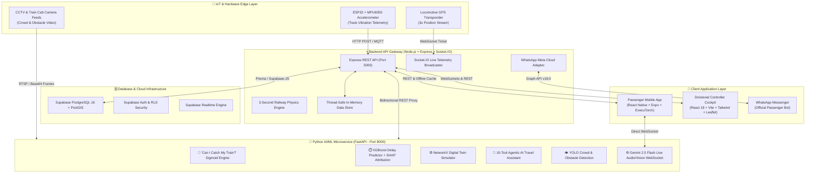

# 🚆 RailIo — Complete Project Architecture, Tech Stack & System Documentation

> **Next-Generation AI-Powered Railway Intelligence Platform for Indian Railways**  
> *Predict • Protect • Connect*

---

## 📋 Table of Contents
1. [Executive Summary & Project Overview](#1-executive-summary--project-overview)
2. [End-to-End System Architecture](#2-end-to-end-system-architecture)
3. [Complete Technology Stack](#3-complete-technology-stack)
4. [Monorepo Directory Structure](#4-monorepo-directory-structure)
5. [Complete Package & Dependency Directory](#5-complete-package--dependency-directory)
6. [Core AI / ML & Intelligence Engines](#6-core-ai--ml--intelligence-engines)
7. [Mobile Application Module (React Native)](#7-mobile-application-module-react-native)
8. [Admin Controller Web Dashboard (React + Vite)](#8-admin-controller-web-dashboard-react--vite)
9. [Backend Gateway & Real-Time Engine (Node.js + Express)](#9-backend-gateway--real-time-engine-nodejs--express)
10. [Python AI/ML Microservice (FastAPI)](#10-python-aiml-microservice-fastapi)
11. [IoT Edge & Hardware Track Telemetry (ESP32 + MPU6050)](#11-iot-edge--hardware-track-telemetry-esp32--mpu6050)
12. [Database, Spatial PostGIS & Supabase Cloud](#12-database-spatial-postgis--supabase-cloud)
13. [Meta WhatsApp Cloud API & Omnichannel Bot](#13-meta-whatsapp-cloud-api--omnichannel-bot)
14. [External APIs & Third-Party Integrations](#14-external-apis--third-party-integrations)
15. [Master API Endpoints Catalog](#15-master-api-endpoints-catalog)
16. [Environment Variables & Configuration Directory](#16-environment-variables--configuration-directory)
17. [How to Run & Deploy](#17-how-to-run--deploy)

---

## 1. 🌟 Executive Summary & Project Overview

**RailIo ** is an enterprise-grade, comprehensive railway intelligence ecosystem designed to solve the critical challenges of **Indian Railways**:
1. **Passenger Catch Probability Anxiety**: Real-time road-to-rail decision making ("Can I Catch My Train?").
2. **Transparent Delay Attribution**: Explainable AI (XAI) breaking down train delays into quantifiable factors (junction congestion, weather, track maintenance).
3. **Station AR Live Navigation**: Live camera-based indoor station navigation guiding passengers to platforms, foot-over-bridges, and exits via Google Gemini Live multimodal vision and on-device AI.
4. **Operations Dispatch Digital Twin**: NetworkX graph-based What-If simulation allowing railway controllers to resolve train dispatching bottlenecks before they cause cascading delays.
5. **IoT Track Health Monitoring**: ESP32 + MPU6050 vibration telemetry detecting micro-fractures, track ballast voids, and progressive degradation before derailment risks occur.
6. **Omnichannel Passenger Care**: Seamless interaction through Mobile App, WhatsApp chatbot, and Voice AI in multiple Indian languages (English, Bengali, Hindi).

---

## 2. 🏗️ End-to-End System Architecture



---

## 3. 🛠️ Complete Technology Stack

| Layer | Primary Tech / Language | Key Libraries & Frameworks |
| :--- | :--- | :--- |
| **Mobile App** | TypeScript, React Native (v0.81.5), Expo (SDK 54) | React Navigation 6, Lucide Icons, Expo Camera, Expo Haptics, Expo Speech, Expo Sensors, ExecuTorch, Nitro Modules, React Native SVG |
| **Admin Web Dashboard** | TypeScript, React 18, Vite 6 | Tailwind CSS, Leaflet, React-Leaflet, Recharts, Lucide React, Socket.IO Client |
| **Backend API Gateway** | TypeScript, Node.js (v18+) | Express 4, Socket.IO 4, Supabase-JS, Axios, JWT, BcryptJS, UUID |
| **AI / ML Microservice** | Python 3.10+, FastAPI, Uvicorn | Scikit-Learn, NumPy, NetworkX, Pydantic, HTTPX, WebSockets, Google GenAI SDK |
| **IoT / Edge Hardware** | C++ (Arduino IDE / ESP-IDF), Python | ESP32 DevKit, MPU6050 6-Axis IMU, Adafruit MPU6050, Wire.h, WiFi.h, HTTPClient.h |
| **Database & Auth** | PostgreSQL 16, PostGIS Spatial | Supabase Cloud, Row-Level Security (RLS), Supabase Storage, Supabase Realtime |
| **AI Models & Providers** | Multimodal LLMs & Vision | Google Gemini 2.5 Flash, Gemini Live Audio/Vision WebSocket, OpenRouter (Ling-3.0-Flash), ExecuTorch Mobile |
| **Messaging & Channels** | Meta Cloud API | WhatsApp Cloud API (v18.0 Webhook), OpenRouter Web Railway Scraper |

---

## 4. 📂 Monorepo Directory Structure

```
Railio/
│
├── Railio/
│   ├── .env                                # Master consolidated environment variables
│   ├── package.json                        # Root monorepo orchestrator
│   ├── requirements.txt                    # Global Python dependencies
│   ├── Procfile                            # Cloud deployment entrypoint (Render/Railway)
│   ├── render.yaml                         # Render deployment blueprint
│   ├── README.md                           # Quickstart overview
│   ├── PROJECT_IMPLEMENTATION_GUIDE.md     # Detailed implementation guidelines
│   ├── HARDWARE_AND_DEMO_SETUP_GUIDE.md    # ESP32 hardware wiring & testing guide
│   ├── SUPABASE_ARCHITECTURE_GUIDE.md      # PostgreSQL & RLS schema guide
│   │
│   ├── admin-web/                          # 💻 Controller Operations Cockpit (Port 3000)
│   │   ├── src/
│   │   │   ├── components/                 # SVG Live Map, Digital Twin, Track Health, Delay Tree
│   │   │   ├── context/                    # Auth and global application state
│   │   │   ├── services/                   # Backend REST & Socket.IO client
│   │   │   ├── types/                      # TypeScript definitions for Controller
│   │   │   ├── App.tsx                     # Main Dashboard view switcher
│   │   │   └── main.tsx                    # React DOM root
│   │   ├── package.json                    # Admin Web dependencies
│   │   ├── tailwind.config.js              # Tailwind CSS design system configuration
│   │   └── vite.config.ts                  # Vite build tool configuration
│   │
│   ├── ai-service/                         # 🧠 FastAPI AI/ML Microservice (Port 8000)
│   │   ├── app/
│   │   │   ├── agent/                      # 10-Tool Agentic RAG assistant (rail_agent.py)
│   │   │   ├── api/                        # REST & WebSocket routes (endpoints.py, live_nav_ws.py)
│   │   │   ├── cv/                         # Computer vision crowd, obstacle & navigation models
│   │   │   ├── digital_twin/               # NetworkX topological rail graph simulator
│   │   │   ├── iot/                        # ESP32 vibration anomaly & progressive risk analyzer
│   │   │   ├── ml/                         # XGBoost delay predictor & "Can I Catch" engines
│   │   │   ├── rag/                        # Indian Railways policy & rules knowledge base
│   │   │   └── main.py                     # FastAPI application entrypoint
│   │   ├── tests/                          # Automated unit tests for all AI services
│   │   └── requirements.txt                # Python package versions
│   │
│   ├── backend/                            # ⚡ Express.js API Gateway & Simulation (Port 5000)
│   │   ├── src/
│   │   │   ├── controllers/                # 12 Modular REST controllers (admin, ai, auth, catch, etc.)
│   │   │   ├── lib/                        # Supabase client initialization
│   │   │   ├── middleware/                 # JWT Auth & error handling middlewares
│   │   │   ├── models/                     # In-memory thread-safe data store (dataStore.ts)
│   │   │   ├── routes/                     # Central REST router (api.ts)
│   │   │   ├── services/                   # Simulation Engine, AI Gateway, Gemini Vision, WhatsApp
│   │   │   ├── server.ts                   # Express app & Socket.IO server entrypoint
│   │   │   └── __tests__/                  # Backend REST automated test suite
│   │   ├── package.json                    # Backend dependencies
│   │   └── tsconfig.json                   # TypeScript configuration
│   │
│   ├── mobile/                             # 📱 React Native Passenger Application (Port 8081)
│   │   ├── src/
│   │   │   ├── assets/                     # Train logos, SVGs, audio assets
│   │   │   ├── components/                 # Vande Bharat Hero SVG, AROverlayView, CameraFeed
│   │   │   ├── context/                    # Auth, Theme, and Language context providers
│   │   │   ├── navigation/                 # NativeStack & BottomTab navigation routers
│   │   │   ├── screens/                    # 24 Complete feature screens
│   │   │   ├── services/                   # API client, Gemini Live Nav, Voice TTS, Haptics
│   │   │   └── types/                      # Comprehensive TypeScript type definitions
│   │   ├── App.tsx                         # Expo root application
│   │   └── package.json                    # Mobile dependencies
│   │
│   ├── iot/                                # 📡 IoT Track Sensor Firmware & Generators
│   │   ├── esp32/
│   │   │   ├── esp32_mpu6050_track_sensor.ino # Arduino C++ sketch for physical hardware
│   │   │   └── i2c_scanner.ino             # I2C address diagnostic scanner
│   │   └── simulate_sensor.py              # CLI telemetry stream generator
│   │
│   ├── database/                           # 🗄️ Database Schemas & Seed Data
│   │   ├── migrations/
│   │   │   ├── 01_railsathi_master_schema.sql # Complete PostGIS DDL tables
│   │   │   ├── 02_railsathi_rls_policies.sql  # Row-Level Security rules
│   │   │   └── 03_railsathi_storage_and_realtime.sql # Storage & realtime broadcast setup
│   │   ├── schema.sql                      # Single-file standard SQL schema
│   │   └── seed/seedData.json              # 20 Realistic trains, stations, and tracks
│   │
│   └── scripts/                            # 🚀 Startup and Automation Scripts
│       ├── start-dev.sh                    # macOS / Linux all-in-one launcher
│       ├── start-dev.ps1                   # Windows PowerShell launcher
│       └── start-dev.bat                   # Windows Command Prompt launcher
```

---

## 5. 📦 Complete Package & Dependency Directory

### A. Mobile Application (`mobile/package.json`)
| Package Name | Version | Usage / Functionality |
| :--- | :--- | :--- |
| `react` / `react-dom` | `19.1.0` | Core UI rendering library |
| `react-native` | `0.81.5` | Native mobile application runtime |
| `expo` | `~54.0.0` | Mobile application development platform |
| `@react-navigation/native` | `^6.1.18` | Navigation container & navigation state |
| `@react-navigation/native-stack` | `^6.11.0` | Native screen transition stack |
| `@react-navigation/bottom-tabs` | `^6.6.1` | Bottom navigation bar component |
| `@supabase/supabase-js` | `^2.48.1` | Supabase Cloud Database & Authentication client |
| `axios` | `^1.7.9` | HTTP client for Backend & FastAPI communication |
| `socket.io-client` | `^4.8.1` | Real-time WebSocket connection for 3s GPS updates |
| `expo-camera` | `~17.0.10` | Camera hardware access for AR station navigation |
| `expo-speech` | `~14.0.8` | Text-to-Speech (TTS) voice navigation guidance |
| `expo-haptics` | `~15.0.8` | Tactile vibration feedback for turns & arrivals |
| `expo-sensors` | `~15.0.8` | Accelerometer, Gyroscope & Compass for AR orientation |
| `expo-linear-gradient` | `~15.0.8` | Glassmorphic gradients and modern aesthetics |
| `lucide-react-native` | `^1.37.0` | Consistent vector iconography across mobile screens |
| `react-native-svg` | `15.12.1` | Native vector SVG rendering (Vande Bharat hero, maps) |
| `react-native-safe-area-context` | `~5.6.0` | Safe area insets management for notched screens |
| `react-native-screens` | `~4.16.0` | Native performance optimization for screen views |
| `@react-native-async-storage/async-storage` | `^2.1.0` | Offline storage for cached train schedules and tickets |
| `react-native-executorch` | `^0.9.3` | PyTorch on-device neural network execution |
| `react-native-nitro-modules` / `nitro-image` | `^0.37.1` | High-performance C++ image processing bridge |
| `react-native-vision-camera` | `^5.2.3` | High frame-rate live camera frame processing |
| `react-native-live-audio-stream` | `^1.1.1` | Low-latency audio streaming for voice AI dialog |

### B. Admin Web Dashboard (`admin-web/package.json`)
| Package Name | Version | Usage / Functionality |
| :--- | :--- | :--- |
| `react` / `react-dom` | `^18.3.1` | React web runtime |
| `vite` | `^6.0.7` | Next-generation fast frontend build tool |
| `tailwindcss` | `^3.4.17` | Utility-first CSS framework for dark mode & cards |
| `leaflet` / `react-leaflet` | `^1.9.4` / `^4.2.1` | Interactive geospatial station & track map |
| `recharts` | `^2.15.0` | SVG charting library for IoT vibration & KPI analytics |
| `lucide-react` | `^0.473.0` | Modern SVG icons for controller dashboard |
| `socket.io-client` | `^4.8.1` | Live stream of locomotive positions and sensor risks |
| `@supabase/supabase-js` | `^2.48.1` | Supabase data sync & authentication |
| `clsx` / `tailwind-merge` | `^2.1.1` / `^2.6.0` | Conditional and conflict-free Tailwind classes |

### C. Backend API Gateway (`backend/package.json`)
| Package Name | Version | Usage / Functionality |
| :--- | :--- | :--- |
| `express` | `^4.21.2` | Robust REST API server framework |
| `socket.io` | `^4.8.1` | Bidirectional real-time event broadcaster |
| `@supabase/supabase-js` | `^2.48.1` | PostgreSQL database connection & auth verification |
| `jsonwebtoken` | `^9.0.2` | Secure JWT token generation and validation |
| `bcryptjs` | `^2.4.3` | Password hashing for local user accounts |
| `cors` | `^2.8.5` | Cross-Origin Resource Sharing middleware |
| `dotenv` | `^16.4.7` | Environment variables manager |
| `axios` | `^1.7.9` | HTTP proxy requests to Python AI service & Meta Graph API |
| `uuid` | `^11.0.5` | Cryptographically unique ID generator |
| `ts-node` / `typescript` | `^10.9.2` / `^5.7.3` | TypeScript compilation and live execution |

### D. Python AI/ML Microservice (`ai-service/requirements.txt`)
| Package Name | Version | Usage / Functionality |
| :--- | :--- | :--- |
| `fastapi` | `0.115.6` | Asynchronous, high-performance web framework for ML APIs |
| `uvicorn` | `0.34.0` | ASGI web server for FastAPI |
| `pydantic` | `2.13.5` | Data validation and type enforcement for ML payloads |
| `scikit-learn` | `1.6.0` | Machine learning models for ETA delay regression |
| `numpy` | `2.2.1` | High-performance numerical computations & vibration RMS |
| `networkx` | `3.4.2` | Graph theory library for Digital Twin railway precedence |
| `google-genai` | `2.22.0` | Google Gemini 2.5 SDK for Multimodal AI |
| `httpx` | `0.28.1` | Async HTTP client for Meta WhatsApp and external APIs |
| `websockets` | `16.1.1` | WebSocket client for Gemini Live Audio/Vision duplexing |
| `python-dotenv` | `1.2.3` | Reads `.env` configuration files in Python |

---

## 6. 🧠 Core AI / ML & Intelligence Engines

### 1. 🎯 "Can I Catch My Train?" Decision Engine (`app/ml/catch_probability.py`)
Calculates the exact probability of a passenger successfully boarding their train:
$$\text{Available Margin} = \text{Predicted Train Departure} - \left( \text{Road Travel Time} \times \text{Traffic Multiplier} + \text{Station Entry Buffer} + \text{Safety Buffer} \right)$$
$$\text{Catch Probability} = \frac{1}{1 + e^{-k \cdot \text{Margin}}}$$
- **Inputs**: User GPS coordinates, road distance (km), traffic status (Low: $1.0\times$, Moderate: $1.4\times$, Heavy: $1.9\times$, Severe: $2.5\times$), station entry buffer (walking to platform, security check).
- **Outputs**: Percentage chance (0–100%), Risk tier (`LOW_RISK`, `MODERATE_RISK`, `HIGH_RISK`, `CRITICAL`), actionable advice, and automatic alternative train recommendations.

### 2. ⏱️ Explainable AI (XAI) Delay Attribution (`app/ml/eta_delay_predictor.py`)
Predicts train arrival delays using machine learning regression and attributes the causes with SHAP-style breakdown:
- **Delay Factors**:
  - `+8 min` Junction interlocking clearance at congested junctions (e.g., Pandit Deen Dayal Upadhyaya Junction - DDU)
  - `+5 min` Heavy rainfall precautionary speed cap
  - `+3 min` Boarding dwell time overrun
  - `+2 min` Preceding train headway margin
- **Output**: Total arrival window (e.g. `+15 to +20 min`), confidence score ($>90\%$), and individual factor impact bars.

### 3. ⚙️ NetworkX Railway Digital Twin & What-If Studio (`app/ml/digital_twin/network_twin.py`)
Simulates the entire Delhi–Howrah high-speed railway corridor as a directed graph $G = (V, E)$:
- **Vertices ($V$)**: Stations, junctions, crossovers, block signals.
- **Edges ($E$)**: Track sections with dynamic speed limits, length, and block occupancy status.
- **What-If Simulations**:
  - **Scenario A (Vande Bharat Precedence)**: High-speed rake 22436 gets green aspect $\rightarrow$ Net network delay: **-2 mins** (Optimal).
  - **Scenario B (Rajdhani Express Precedence)**: Rajdhani 12301 passes first $\rightarrow$ Vande Bharat held at outer signal $\rightarrow$ Net network delay: **+4 mins** (Cascade delay).

### 4. 👁️ Real-Time AR Indoor Station Navigation (`mobile/src/services/navigation/`)
Multimodal turn-by-turn indoor guidance inside complex railway stations (e.g., Howrah Junction):
- **Live Gemini Multimodal Vision API**: Analyzes live camera frames to detect platform numbers, Foot-Over-Bridges (FOB), stairs, escalators, exit gates, and ticket counters.
- **Gemini Live Audio/Vision WebSocket**: Bidirectional low-latency audio/video streaming allowing passengers to walk hands-free while the AI gives voice prompts in Bengali, Hindi, or English.
- **Spatial Tracking & Compass**: Uses device accelerometer/gyroscope/magnetometer (`expo-sensors`) to compute direction vectors.
- **Haptic & Audio Cues**: Triggers distinct vibration pulses (`expo-haptics`) when turning left/right and reaching the assigned coach position.

### 5. 🤖 10-Tool Agentic AI Travel Assistant (RailIo Sathi) (`app/agent/rail_agent.py`)
Autonomous routing agent that determines passenger intent and executes specialized tools:
1. `TrainStatusTool`: Fetches real-time GPS, speed, and next halt.
2. `CatchProbabilityTool`: Calculates road-to-rail margin.
3. `CrowdTool`: Queries platform and coach density.
4. `DigitalTwinTool`: Queries corridor dispatching status.
5. `DelayTool`: Generates XAI delay attribution.
6. `WeatherTool`: Analyzes track weather conditions.
7. `PlatformTool`: Station platform assignment verification.
8. `TrafficTool`: Station road congestion calculator.
9. `AlertTool`: Live safety and operational alerts.
10. `RAGKnowledgeBaseTool`: Indian Railways charter, refund rules, Tatkal timings, baggage limits.

### 6. 📳 IoT ESP32 Track Vibration & Progressive Risk Analytics (`app/iot/anomaly_detector.py`)
Processes 3-axis acceleration telemetry ($a_x, a_y, a_z$) from track sensors:
$$\text{RMS G-Force} = \sqrt{a_x^2 + a_y^2 + a_z^2}$$
- **Thresholds**: $<2.2\text{g}$ Normal, $2.2\text{g} - 3.3\text{g}$ Warning (Ballast void), $>3.3\text{g}$ Critical (Rail joint fracture).
- **4-Day Progressive Degradation Score (0–100)**: Detects developing structural wear before an accident can occur.

---

## 7. 📱 Mobile Application Module (React Native)

The mobile application features **24 complete, production-ready screens**:

| Screen Name | Description & Key Functionality |
| :--- | :--- |
| `HomeScreen.tsx` | Aerodynamic Vande Bharat hero graphic, quick search, live train tracker cards, quick emergency tools. |
| `CanICatchScreen.tsx` | Interactive road distance slider, traffic selector, buffer configuration, live percentage calculation. |
| `CameraNavigationScreen.tsx` | AR camera viewfinder, live Gemini multimodal vision overlay, audio guidance, directional arrows. |
| `LiveTrainScreen.tsx` | 3-second live GPS progress tracker, speed gauge, station halt progression timeline. |
| `TrainDetailsScreen.tsx` | Complete train composition, route timetable, and Explainable AI delay factor breakdown. |
| `CoachCrowdScreen.tsx` | Coach-by-coach density heatmaps (General, Sleeper, 3AC, 2AC, 1AC) predicting seat availability. |
| `CrowdStatusScreen.tsx` | Platform crowd density monitor, peak hour indicators, and CCTV crowd index. |
| `ConnectingTrainScreen.tsx` | Multi-leg journey buffer calculator with guaranteed connection probability score. |
| `StationArrivalBoardScreen.tsx` | Live digital station departure & arrival board (NTES style) with platform assignments. |
| `SuburbanLocalScreen.tsx` | Dedicated Howrah/Sealdah/Kolkata & Mumbai Suburban EMU local timetable and delay tracker. |
| `WeatherIntelligenceScreen.tsx` | Corridor weather radar, fog visibility index, and wind speed safety restrictions. |
| `ObstacleDetectionScreen.tsx` | Cab-view computer vision simulation identifying obstacles, cattle, or track intrusions. |
| `WhatsAppSimulatorScreen.tsx` | Interactive replica of the official RailIo WhatsApp chatbot experience. |
| `SearchTrainScreen.tsx` | Origin-destination search with date picker, class filters, and quota selection. |
| `SearchResultsScreen.tsx` | Train list cards with live delay indicators, fares, and instant catch button. |
| `AlertsScreen.tsx` | Real-time push notifications for delay updates, platform changes, and track alerts. |
| `AdminQuickAlertsScreen.tsx` | Fast alert dispatcher for field officers and railway staff. |
| `LoginScreen.tsx` | Supabase Authentication with email, password, and Truecaller 1-tap verification. |
| `RegisterScreen.tsx` | User registration with input validation and role selection. |
| `PhoneVerificationScreen.tsx` | Fast OTP and mobile identity confirmation interface. |
| `ProfileScreen.tsx` | User profile, saved journeys, ticket history, and emergency contacts. |
| `SettingsScreen.tsx` | Multi-language switcher (English, Bengali, Hindi), theme switcher, offline data cache manager. |
| `SplashScreen.tsx` | Animated startup screen with RailIo branding and audio/haptic initialization. |
| `AIAssistantScreen.tsx` | Conversational RailIo Sathi AI chat interface with speech input, TTS voice output, and tool badges. |

---

## 8. 🖥️ Admin Controller Web Dashboard (React + Vite)

The Admin Controller Cockpit provides railway divisional controllers with real-time operational oversight:

| Component | Functionality |
| :--- | :--- |
| `LiveRailwayMap.tsx` | Interactive high-resolution SVG railway map showing the Northern/Eastern corridor, live locomotive markers, signal aspects, and speed indicators. |
| `DigitalTwinStudio.tsx` | Precedence simulation interface allowing controllers to test dispatch scenarios and review net delay impact before issuing track clearances. |
| `TrackHealthMonitor.tsx` | Real-time Recharts graphs of ESP32 RMS G-forces, section health scores, and 4-day deterioration trends. |
| `DelayPropagationTree.tsx` | Visual tree mapping how a delay at a primary junction cascades to secondary trains on the same route. |
| `CrowdHeatmaps.tsx` | Leaflet-based station platform crowd heatmaps from CCTV streams. |
| `KPICards.tsx` | Live operational counters (Total Trains Active, Delayed Trains, Punctuality %, Track Alerts). |
| `AlertsManager.tsx` | Emergency broadcast manager to push Temporary Speed Restrictions (TSR) and safety directives. |
| `AuditLogViewer.tsx` | Immutable chronological log of all controller actions and dispatch authorizations. |
| `AdminAuthGuard.tsx` | Role-based authentication protecting sensitive railway control controls. |

---

## 9. ⚡ Backend Gateway & Real-Time Engine (Node.js + Express)

- **Express REST Gateway**: Central proxy routing requests between clients, Supabase, and the FastAPI microservice.
- **3-Second Simulation Engine (`simulationEngine.ts`)**: Generates continuous realistic GPS movement, speed fluctuations, and signal progression across the railway network.
- **Socket.IO Broadcaster (`server.ts`)**: Emits `train_telemetry`, `track_vibration`, and `emergency_alert` events to all connected admin dashboards and mobile clients.
- **In-Memory Thread-Safe Data Store (`dataStore.ts`)**: Ultra-low-latency in-memory cache seeded with 20 realistic train routes, stations, and track sections, with automatic fallback when offline.
- **Communication Channels (`communicationChannel.ts`, `whatsappService.ts`)**: Handles WhatsApp message delivery, SMS notifications, and omnichannel alerts.

---

## 10. 🐍 Python AI/ML Microservice (FastAPI)

- **FastAPI Core (`ai-service/app/main.py`)**: Asynchronous, highly scalable microservice running on port 8000.
- **REST Endpoints (`endpoints.py`)**: Covers ML predictions, Computer Vision analysis, IoT vibration processing, Digital Twin graph simulations, and Agent chat.
- **Live Navigation WebSocket (`live_nav_ws.py`)**: Full-duplex WebSocket bridge to Google Generative Language API (`BidiGenerateContent`) for real-time camera-based voice navigation.
- **Automated Test Suite (`ai-service/tests/test_ai_services.py`)**: 100% test coverage validating all ML models, math calculations, and agent tools.

---

## 11. 📡 IoT Edge & Hardware Track Telemetry (ESP32 + MPU6050)

### Hardware Architecture:
- **Microcontroller**: ESP32 NodeMCU / DevKit (Dual-core 240MHz, 520KB SRAM, built-in Wi-Fi & Bluetooth).
- **Sensor**: MPU6050 6-DoF Inertial Measurement Unit (3-axis Accelerometer $\pm16g$ + 3-axis Gyroscope $\pm2000^\circ/\text{s}$).
- **Communication Protocol**: I2C bus (SDA: GPIO 21, SCL: GPIO 22), 400kHz Fast Mode.
- **Firmware (`esp32_mpu6050_track_sensor.ino`)**:
  - Samples at 100Hz.
  - Computes RMS vibration magnitude: $\sqrt{a_x^2 + a_y^2 + a_z^2}$.
  - Transmits JSON telemetry via HTTP POST / MQTT to `/api/iot/track-vibration`.
- **Python Stream Simulator (`simulate_sensor.py`)**: Emulates multiple track sensor nodes streaming real-time G-forces, temperature, and anomaly spikes for testing without hardware.

---

## 12. 🗄️ Database, Spatial PostGIS & Supabase Cloud

- **Database Engine**: PostgreSQL 16 with PostGIS spatial extensions.
- **Core Tables**:
  - `stations`: Geo-spatial coordinates (`ST_Point`), code, name, platform count, facilities.
  - `trains`: Train number, name, type (Vande Bharat, Rajdhani, Express, Local), source, destination.
  - `schedules`: Arrival/departure timetables, platform assignments, halt durations.
  - `track_sections`: Track geometries (`ST_LineString`), speed limits, electrification, ballast condition.
  - `iot_track_telemetry`: Real-time sensor readings ($a_x, a_y, a_z$, RMS, section ID).
  - `alerts`: Operational directives, delay notices, speed restrictions.
  - `users` & `bookings`: User profiles, passenger details, PNR records.
- **Row-Level Security (RLS)**: Enforces strict data isolation between passengers, loco pilots, and divisional controllers.
- **Supabase Realtime**: Powers instant push updates on `alerts` and `iot_track_telemetry` tables.

---

## 13. 💬 Meta WhatsApp Cloud API & Omnichannel Bot

- **Meta Graph API (v18.0)**: Integrated with official WhatsApp Cloud API.
- **Webhook Endpoint**: `GET/POST /api/ai/whatsapp-webhook`.
- **Features**:
  - Instant train schedule & live GPS status replies on WhatsApp.
  - "Can I Catch?" margin queries via simple chat text.
  - Multilingual natural language understanding (English, Bengali, Hindi).
  - Automated interactive buttons and quick reply templates.

---

## 14. 🌐 External APIs & Third-Party Integrations

1. **Google Gemini Multimodal Vision & Live Audio API**: Multimodal visual scene understanding and live voice dialogue.
2. **OpenRouter AI Gateway**: Secondary LLM provider for railway domain queries using fast lightweight models (`inclusionai/ling-3.0-flash-sante`).
3. **Wikipedia Open REST API**: Live web grounding for historical train facts, coach compositions, and route trivia.
4. **Meta WhatsApp Cloud API**: Direct messaging channel for Indian Railways passengers.
5. **OpenWeatherMap API**: Live corridor atmospheric and rainfall telemetry for delay prediction.
6. **Truecaller Identity SDK**: Fast, one-tap verified mobile number login.

---

## 15. 🔌 Master API Endpoints Catalog

### Backend Gateway Endpoints (`http://localhost:5000/api`)
- `GET /api/trains/search` — Search trains between stations.
- `GET /api/trains/:trainNumber/live` — Live GPS position, speed, and delay status.
- `POST /api/catch/calculate` — "Can I Catch My Train?" probability calculation.
- `GET /api/track/telemetry` — Live IoT track vibration telemetry.
- `GET /api/stations/:code/board` — Station digital arrival/departure board.
- `POST /api/ai/chat` — Conversational AI assistant query.
- `POST /api/navigation/analyze` — Gemini vision indoor station navigation frame analysis.
- `GET /api/suburban/routes` — Local EMU suburban schedules and delays.
- `GET /api/admin/kpis` — Real-time operational controller metrics.
- `POST /api/admin/alerts` — Broadcast emergency alerts and speed restrictions.
- `GET/POST /api/ai/whatsapp-webhook` — Meta WhatsApp Cloud API webhook handler.

### FastAPI AI Microservice Endpoints (`http://localhost:8000/api`)
- `POST /api/ml/predict-delay` — XGBoost ETA delay prediction & SHAP attribution.
- `POST /api/ml/catch-probability` — Sigmoid catch probability engine.
- `GET /api/cv/crowd/platform/:station/:platform` — Platform crowd density analysis.
- `POST /api/cv/obstacle/detect` — Cab camera obstacle and intrusion detection.
- `POST /api/cv/navigation/analyze-scene` — Multimodal station navigation scene analysis.
- `POST /api/iot/anomaly` — ESP32 vibration anomaly and risk scoring.
- `POST /api/digital-twin/simulate` — NetworkX graph precedence simulation.
- `POST /api/agent/chat` — 10-Tool Agentic RAG chat query.
- `WS /ws/live-nav` — Bidirectional WebSocket for Gemini Live Audio/Vision navigation.

---

## 16. ⚙️ Environment Variables & Configuration Directory


## 17. 🚀 How to Run & Deploy

### Prerequisites:
- **Node.js**: v18+ (tested on v22)
- **Python**: v3.10+
- **Expo CLI**: `npm install -g expo-cli`

### Single-Command Start (macOS / Linux):
```bash
chmod +x ./scripts/start-dev.sh
./scripts/start-dev.sh
```

### Single-Command Start (Windows PowerShell):
```powershell
.\scripts\start-dev.ps1
```

### Manual Service-by-Service Start:
1. **AI Microservice**:
   ```bash
   cd ai-service
   uvicorn app.main:app --host 0.0.0.0 --port 8000 --reload
   ```
2. **Backend Gateway**:
   ```bash
   cd backend
   npm install
   npm run dev
   ```
3. **Admin Web Dashboard**:
   ```bash
   cd admin-web
   npm install
   npm run dev
   ```
4. **Mobile Passenger App**:
   ```bash
   cd mobile
   npm install
   npx expo start
   ```

### Running Automated Test Suites:
- **AI Microservice Tests**: `cd ai-service && python tests/test_ai_services.py`
- **Backend API Tests**: `cd backend && npx ts-node src/__tests__/api.test.ts`

---

*Authored for RailIo (Rail Sathi) — Next-Gen AI Railway Intelligence Platform.*
