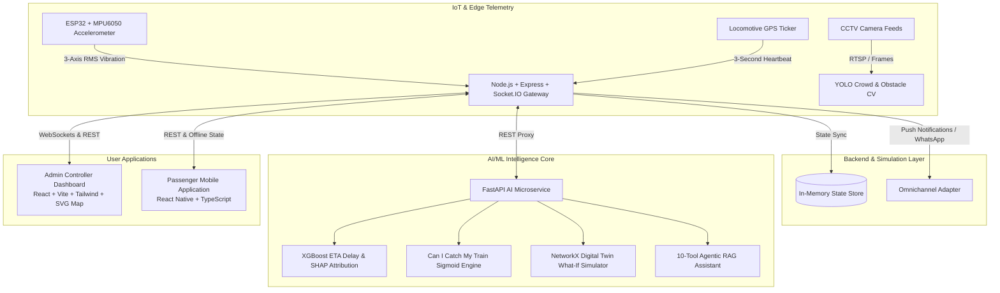

# 🚆 RailSathi (Smart Rail AI)

### *Predict • Protect • Connect*

> **Next-Generation AI Railway Intelligence Platform for Indian Railways**  
> Real-Time Train Telemetry, IoT Track Anomaly Detection, Digital Twin What-If Dispatching, Computer Vision Safety, RAG-Powered Conversational AI, and the Hero **"Can I Catch My Train?"** Decision Engine.

---

## 🌟 Executive Summary

**RailSathi** is an enterprise-grade, end-to-end intelligent railway operations and passenger assistance platform built specifically for Indian Railways. It bridges the gap between high-frequency telemetry (train GPS, ESP32 track accelerometers, CCTV crowd streams) and actionable decision-making for both **Rail Passengers** and **Divisional Railway Controllers**.



---

## 🚀 Key Feature Highlights

### 1. 🎯 "Can I Catch My Train?" (Hero Feature)
Multi-factor probability engine calculating if a passenger can reach and board their departing train:
$$\text{Available Margin} = \text{Train Predicted Dep.} - \left(\text{Road Travel Time} \times \text{Traffic Multiplier} + \text{Station Entry Buffer} + \text{Safety Buffer}\right)$$
- Evaluates live road traffic congestion (Low, Moderate, Heavy, Severe).
- Adjusts for station platform distance and security dwell times.
- Dynamically outputs **Percentage Probability**, Risk Level, and alternate connecting train recommendations.

### 2. 🧠 Explainable AI (XAI) Delay Attribution
Breaks down train delays into quantifiable SHAP-style component factors:
- `+8 min` Junction interlocking clearance at DDU
- `+5 min` Heavy rainfall precautionary speed cap
- `+3 min` Boarding dwell overrun
- `+2 min` Preceding train headway margin
- **Output**: Total expected arrival window + confidence score.

### 3. ⚙️ NetworkX Digital Twin & What-If Precedence Simulator
Simulates cascading railway delay propagation and interactive dispatcher decisions:
- Scenario A: Give high-speed **Vande Bharat Express** precedence $\rightarrow$ saves net **-2 minutes** across network.
- Scenario B: Prioritize Rajdhani Express $\rightarrow$ increases total network delay by **+8 minutes**.

### 4. 📳 IoT ESP32 Track Vibration & Progressive Risk Analytics
- MPU6050 3-axis accelerometer streaming real-time G-force telemetry ($a_x, a_y, a_z$).
- Real-time RMS vibration thresholding ($>3.3\text{g} \rightarrow \text{CRITICAL}$).
- 4-Day deterioration trend scoring (0–100) identifying developing rail joint gaps and ballast voids before structural failures occur.

### 5. 🤖 10-Tool Agentic AI Travel Assistant (RailSathi Sathi)
Conversational assistant equipped with multi-tool routing:
- `TrainStatusTool`, `CatchProbabilityTool`, `CrowdTool`, `DigitalTwinTool`, `DelayTool`, `WeatherTool`, `PlatformTool`, `TrafficTool`, `AlertTool`, and `RAGKnowledgeBaseTool`.

### 6. 💬 WhatsApp Omnichannel Simulator
Interactive WhatsApp-style conversational view mirroring the official RailSathi chatbot experience.

---

## 🛠️ Architecture & Tech Stack

| Layer | Technologies Used |
| :--- | :--- |
| **Mobile App (Android / iOS / Web)** | **Strictly React Native + TypeScript** + Expo + React Navigation + SVG Hero Graphics |
| **Admin Controller Dashboard** | React 18 + TypeScript + Vite + Tailwind CSS + Lucide Icons + Recharts |
| **Backend Gateway & Simulation** | Node.js + Express + Socket.IO + TypeScript + JWT Authentication |
| **AI / ML Microservice** | Python 3.10 + FastAPI + Uvicorn + NumPy + Scikit-Learn + NetworkX + Pydantic |
| **IoT & Edge Hardware** | ESP32 Dev Board + MPU6050 6-DoF IMU (Arduino C++ Firmware + Python Simulator) |
| **Database & Schema** | PostgreSQL 16 + PostGIS Spatial Schema + Zero-Latency In-Memory Fallback |

---

## 📂 Monorepo Structure

```
railsathi/
├── ai-service/                 # FastAPI AI/ML Microservice (Port 8000)
│   ├── app/
│   │   ├── agent/             # 10-Tool Agentic AI Router
│   │   ├── cv/                # YOLO Platform Crowd & Obstacle Detection
│   │   ├── digital_twin/      # NetworkX Topological Graph Simulator
│   │   ├── iot/               # Track Vibration Anomaly Detector
│   │   ├── ml/                # XGBoost Delay & "Can I Catch" Engines
│   │   ├── rag/               # Indian Railways Policy Knowledge Base
│   │   ├── api/endpoints.py   # FastAPI REST Router
│   │   └── main.py            # Microservice Entrypoint
│   └── tests/                 # AI/ML Unit Tests
│
├── backend/                    # Node.js + Express Gateway (Port 5000)
│   ├── src/
│   │   ├── controllers/       # Modular API Route Handlers
│   │   ├── models/            # In-Memory Thread-Safe Data Store
│   │   ├── routes/            # Express REST Router
│   │   ├── services/          # 3-Second Simulation Engine & AI Proxy
│   │   └── server.ts          # Main Server & Socket.IO Listener
│   └── src/__tests__/         # Backend API Automated Tests
│
├── mobile/                     # Passenger Mobile App (Strictly React Native)
│   ├── src/
│   │   ├── components/        # VandeBharatHero SVG & Reusable Cards
│   │   ├── navigation/        # RootStack & BottomTab Navigators
│   │   ├── screens/           # 18 Fully Functional Screens
│   │   ├── services/api.ts    # REST Client with 100% Offline Fallback
│   │   └── types/index.ts     # TypeScript Interfaces
│   ├── App.tsx                # Expo App Entrypoint
│   └── package.json
│
├── admin-web/                  # Controller Operations Dashboard (Port 3000)
│   ├── src/
│   │   ├── components/        # SVG Live Map, Digital Twin, Delay Tree, Track Health
│   │   ├── App.tsx            # Main Operations Dashboard
│   │   └── index.css          # Tailwind Design System
│   └── vite.config.ts
│
├── database/                   # Database Schemas & Migrations
│   ├── schema.sql             # PostgreSQL + PostGIS Schema
│   └── seed/seedData.json     # 20 Realistic Station & Train Records
│
├── iot/                        # Track Sensor Firmware & Stream Simulator
│   ├── esp32/                 # Arduino C++ Sketch for ESP32 + MPU6050
│   └── simulate_sensor.py     # Python Telemetry Generator CLI
│
└── scripts/                    # All-in-One Startup Automation
    ├── start-dev.ps1          # PowerShell All-in-One Launcher
    ├── start-dev.bat          # Windows Command Prompt Launcher
    └── start-dev.sh           # Linux / macOS Bash Launcher
```

---

## ⚡ Quickstart: Run the Full System

### Prerequisites
- **Node.js**: v18+ (tested on v22)
- **Python**: v3.10+ (with `fastapi`, `uvicorn`, `scikit-learn`, `networkx`, `numpy`)
- **Package Manager**: `npm`

### Single-Command Start (Windows PowerShell)
```powershell
.\scripts\start-dev.ps1
```

### Single-Command Start (Windows Command Prompt)
```cmd
.\scripts\start-dev.bat
```

### Single-Command Start (Linux / macOS)
```bash
chmod +x ./scripts/start-dev.sh
./scripts/start-dev.sh
```

---

## 🌐 Active Service Endpoints

| Service | URL | Description |
| :--- | :--- | :--- |
| **Admin Controller Dashboard** | `http://localhost:3000` | Real-time SVG train map, What-If studio, delay propagation tree, track health charts. |
| **Mobile App (Web Preview)** | `http://localhost:8081` | Passenger interface with "Can I Catch?", Live GPS, XAI delay attribution, AI Sathi chat. |
| **Backend API Gateway** | `http://localhost:5000/api` | Express REST API & Socket.IO 3-second simulation broadcaster. |
| **FastAPI Microservice** | `http://localhost:8000/docs` | Interactive Swagger documentation for all ML, CV, IoT, and RAG endpoints. |

---

## 🧪 Running Automated Tests

### 1. Test All AI/ML Microservice Modules
```bash
cd ai-service
python tests/test_ai_services.py
```
*Validates ETA delay prediction, SHAP attribution, "Can I Catch My Train?" sigmoid engine, ESP32 vibration anomaly detection, NetworkX precedence simulation, and 10-tool agent routing.*

### 2. Test Backend REST APIs
```bash
cd backend
npx ts-node src/__tests__/api.test.ts
```
*Validates Auth login, train search, live telemetry, catch probability, digital twin, and track health endpoints.*

---

## 🎬 End-to-End Hackathon Demonstration Script

1. **Open Admin Dashboard (`http://localhost:3000`)**:
   - Observe live trains moving along the Delhi–Howrah corridor on the interactive SVG map with 3-second GPS updates.
   - Review live KPI metrics (142 Active Trains, 27 Delayed, 3 Critical Track Risks, 88.4% Punctuality).
2. **Explore Track Health Monitor**:
   - Observe real-time RMS vibration charts and the 4-day progressive track deterioration graph for Section `HWH-B17`.
3. **Run What-If Precedence Simulation**:
   - In Digital Twin Studio, select **"Prioritize Vande Bharat 22436"**.
   - Observe the live recalculation: saves **-2 minutes net network delay**, showing why giving priority to high-speed rakes prevents system-wide bottlenecks.
4. **Switch to Passenger Mobile App (`http://localhost:8081`)**:
   - Admire the aerodynamic **Vande Bharat hero visual** and instant search card.
   - Tap **"🎯 Can I Catch?"** (Hero Feature).
   - Adjust the Road Distance, Traffic Slider (Moderate $\rightarrow$ Heavy), and Station Buffer.
   - Watch the live percentage probability update instantaneously from **91% (High Chance)** to **22% (Critical Risk)** with alternate train advice.
5. **Inspect Explainable AI (XAI)**:
   - Open Train Details for **Train 12301**.
   - Review the delay breakdown attributing +8m to junction congestion, +5m to rain, and +3m to dwell time.
6. **Chat with RailSathi AI Agent**:
   - Ask: *"Can I catch train 12301?"* or *"Which coach is less crowded?"*.
   - Inspect the agent's tool execution badges (`CatchProbabilityTool`, `TrafficTool`, `ETAPredictionTool`).

---

## 🔒 Safety & Regulatory Disclaimer

> **Prototype Notice**: RailSathi is an engineering demonstration prototype developed for hackathons and technical showcases. Machine learning predictions, computer vision detections, and IoT vibration metrics are designed for operational decision-support and do not replace certified Indian Railways safety equipment (e.g., KAVACH, solid-state interlocking, RDSO-certified track inspection vehicles).

---

## 👥 Authors & Acknowledgments

- **Engineered with Google DeepMind Antigravity AI**
- Dedicated to modernizing and accelerating safety intelligence across the **Indian Railways Network**.
