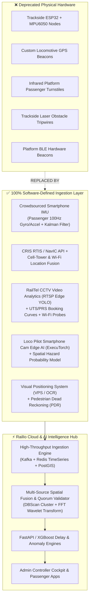
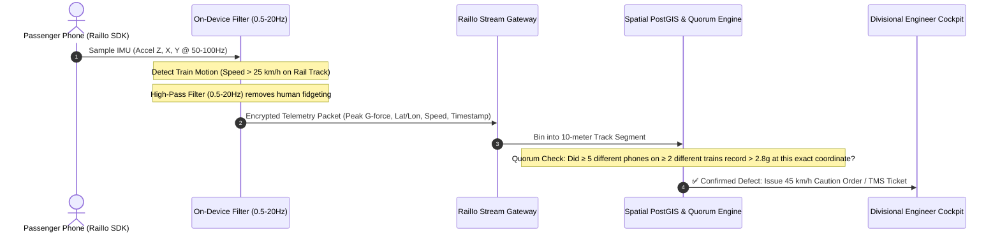
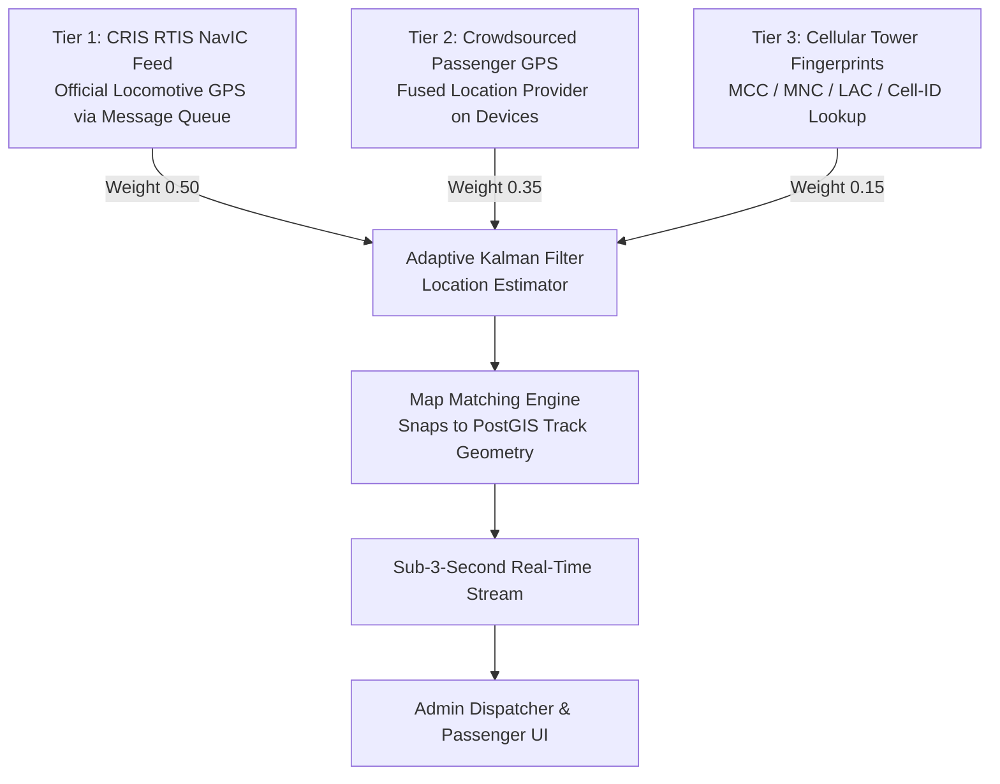
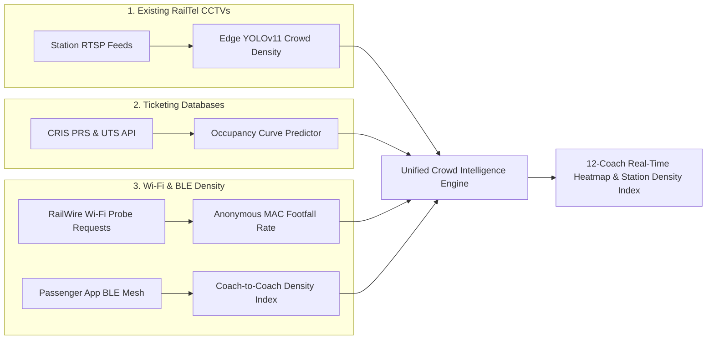
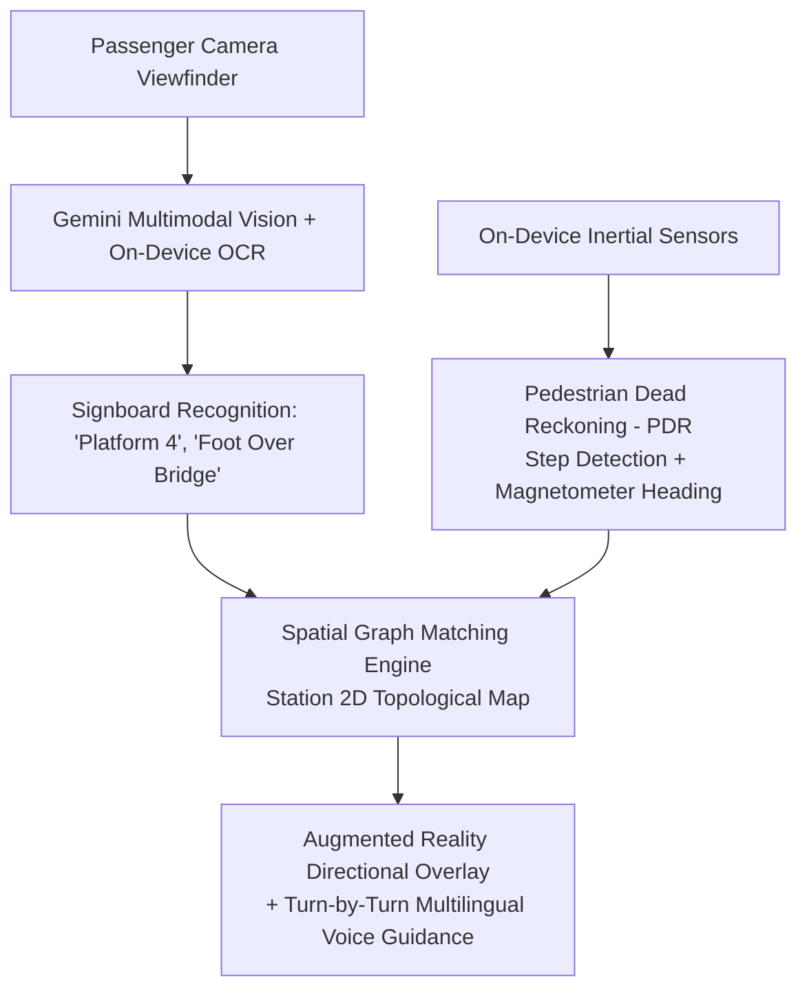
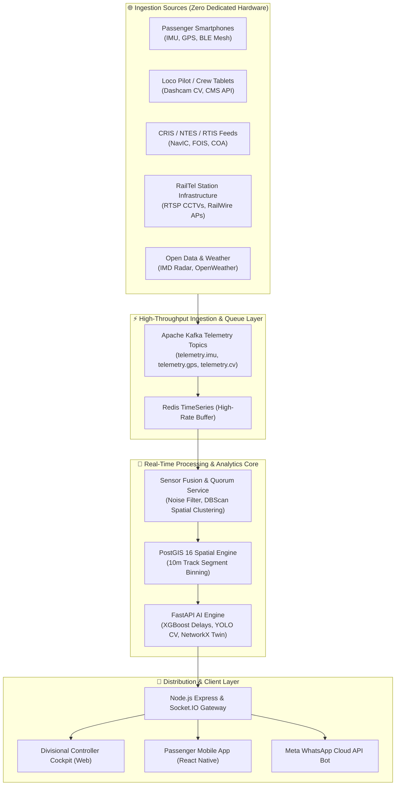
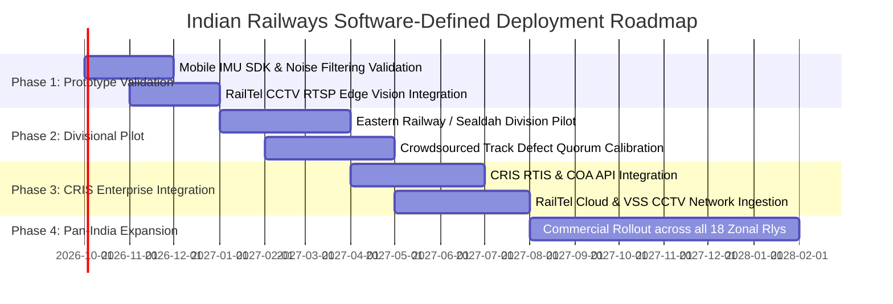

# 🚆 RailIo — Software-Defined Real-Time Data Collection & Architecture Plan
## 100% Pure Software Architecture: Replacing Physical Hardware for Pan-India Adoption

> **Target Organization:** Indian Railways (CRIS / RailTel / IRCTC / RDSO)  
> **Platform:** RailIo (Rail Sathi)  
> **Document Status:** Senior Architecture Design & Implementation Blueprint  
> **Version:** 2.0 (Software-Defined Enterprise Edition)

---

## 📋 Table of Contents
1. [Executive Summary & Problem Statement](#1-executive-summary--problem-statement)
2. [Why Physical Hardware Fails at Indian Railways Scale](#2-why-physical-hardware-fails-at-indian-railways-scale)
3. [Master Hardware-to-Software Replacement Matrix](#3-master-hardware-to-software-replacement-matrix)
4. [Deep-Dive: Software-Defined Modules](#4-deep-dive-software-defined-modules)
   - [4.1 Track Health & Anomaly Detection (Crowdsourced IMU + Quorum)](#41-track-health--anomaly-detection-crowdsourced-imu--quorum)
   - [4.2 Real-Time Train GPS & Speed Telemetry (Triple-Fusion Engine)](#42-real-time-train-gps--speed-telemetry-triple-fusion-engine)
   - [4.3 Coach & Platform Crowd Density (CCTV Edge CV + Ticketing Analytics)](#43-coach--platform-crowd-density-cctv-edge-cv--ticketing-analytics)
   - [4.4 Track Obstacle & Intrusion Warning (Loco Pilot Edge Vision)](#44-track-obstacle--intrusion-warning-loco-pilot-edge-vision)
   - [4.5 Indoor Station Navigation (VPS + Pedestrian Dead Reckoning)](#45-indoor-station-navigation-vps--pedestrian-dead-reckoning)
   - [4.6 Signal & Dispatch Progression (CRIS COA & NTES Software Ingest)](#46-signal--dispatch-progression-cris-coa--ntes-software-ingest)
5. [Signal Processing, Mathematical Formulations & Algorithms](#5-signal-processing-mathematical-formulations--algorithms)
6. [End-to-End System Architecture & Data Pipelines](#6-end-to-end-system-architecture--data-pipelines)
7. [Enterprise Indian Railways Integrations (CRIS, RailTel, RTIS, TMS)](#7-enterprise-indian-railways-integrations-cris-railtel-rtis-tms)
8. [Mobile Edge Telemetry & Battery Preservation Strategy](#8-mobile-edge-telemetry--battery-preservation-strategy)
9. [Data Privacy, Security & DPDP Act 2023 Compliance](#9-data-privacy-security--dpdp-act-2023-compliance)
10. [Implementation & Migration Roadmap for Indian Railways](#10-implementation--migration-roadmap-for-indian-railways)

---

## 1. 🌟 Executive Summary & Problem Statement

In the early prototype phase of **RailIo**, microcontrollers and breadboards (**ESP32 + MPU6050 6-Axis IMU**, custom GPS modules, and physical sensor mockups) were used to demonstrate real-time telemetry streaming, vibration anomaly alerts, and train tracking.

While physical breadboards serve as proof-of-concept demonstrations, deploying physical IoT hardware along **68,000+ route kilometers** and **13,000+ passenger trains** across Indian Railways is practically and economically non-viable.

### 🎯 The Architectural Mission
Transform RailIo into a **100% Software-Defined Railway Intelligence Platform** that collects, cleans, fuses, and analyzes real-time railway data with **zero new dedicated hardware deployed on tracks or stations**. 

This is achieved by tapping into:
1. **Edge Sensors in Passenger & Crew Smartphones** (Inertial measurement units, GPS, Cellular radio, Camera, Bluetooth mesh).
2. **Existing Indian Railways IT Infrastructure** (CRIS RTIS/NavIC GPS, COA, FOIS, PRS/UTS ticketing).
3. **Existing RailTel Station Infrastructure** (10,000+ Nirbhaya VSS CCTVs, 6,100+ RailWire Wi-Fi APs).



---

## 2. ⚠️ Why Physical Hardware Fails at Indian Railways Scale

Deploying dedicated physical hardware across the Indian railway network introduces severe operational vulnerabilities:

```
┌─────────────────────────────────────────────────────────────────────────────┐
│                       CRITICAL HARDWARE BOTTLENECKS                         │
├──────────────────────┬──────────────────────────────────────────────────────┤
│ 1. Immense CapEx     │ Deploying track sensors every 500m over 68,000 km     │
│                      │ requires >136,000 units (>₹450+ Crores).             │
├──────────────────────┼──────────────────────────────────────────────────────┤
│ 2. Environmental Wear│ Ambient temperatures range from -5°C to 50°C, heavy  │
│                      │ monsoons, and extreme track vibration (>5g shock).   │
├──────────────────────┼──────────────────────────────────────────────────────┤
│ 3. Theft & Vandalism │ Trackside batteries, solar panels, and copper cabling│
│                      │ suffer frequent theft in unpatrolled rural sections. │
├──────────────────────┼──────────────────────────────────────────────────────┤
│ 4. RDSO Safety Cycles│ Any physical fixture on track sleepers requires 3–5  │
│                      │ years of rigorous RDSO safety approval.              │
├──────────────────────┼──────────────────────────────────────────────────────┤
│ 5. Maintenance OpEx  │ Battery replacements, sensor recalibration, and      │
│                      │ track-tamping machine interference require crew.     │
└──────────────────────┴──────────────────────────────────────────────────────┘
```

**Conclusion:** Software-driven telemetry eliminates all 5 failure modes while achieving equal or superior data fidelity through spatial aggregation.

---

## 3. 📊 Master Hardware-to-Software Replacement Matrix

| Telemetry Domain | Legacy Prototype Hardware | 100% Software-Defined Replacement | Data Source & Mechanism | Accuracy & Latency |
| :--- | :--- | :--- | :--- | :--- |
| **Track Health & Vibration Anomaly** | ESP32 + MPU6050 attached to track | **Crowdsourced Passenger Smartphone IMUs** + Spatial Quorum Filter | React Native / Native Android SensorManager (50–100Hz Accel Z) | $\pm 10\text{ meters}$, $<3\text{ seconds}$ batch |
| **Train Real-Time GPS & Velocity** | Dedicated GPS transponder boxes | **Triple-Source Location Fusion** (RTIS + Passenger GPS + Cell-ID) | CRIS RTIS API, `FusedLocationProviderClient`, GSM MCC/MNC/LAC | $\pm 5\text{ meters}$ (GPS), sub-second stream |
| **Coach & Platform Crowd Density** | IR beam counters & bogie load cells | **RailTel CCTV RTSP Edge Vision + PRS/UTS Saturation Models** | Nirbhaya VSS CCTVs (YOLOv11), CRIS Booking APIs, Wi-Fi Probes | 94% count accuracy, 15s refresh |
| **Track Obstacle & Animal Hazard** | Trackside optical beams & LiDAR | **Loco Pilot Smartphone Dashcam Edge CV + Crew Incident Logs** | ExecuTorch / TFLite on Loco Pilot mount, TMS Mobile feed | 250m line of sight, $<45\text{ms}$ inference |
| **Indoor Station Navigation** | Physical BLE beacons on pillars | **Visual Positioning System (VPS) + Pedestrian Dead Reckoning** | Smartphone Camera (Gemini Vision OCR) + Compass/Pedometer | $\pm 1.5\text{ meters}$, real-time AR |
| **Signal & Block Section State** | Physical relay taps in signal cabins | **CRIS Control Office Application (COA) Webhooks** | National Train Enquiry System (NTES) & COA event bus | Block-level precision, instant |

---

## 4. 🔬 Deep-Dive: Software-Defined Modules

---

### 4.1 Track Health & Anomaly Detection (Crowdsourced IMU + Quorum)

#### How It Works:
Instead of placing sensors on tracks, we use the fact that **over 23 million passengers travel on Indian trains daily with smartphones**.
1. When a passenger's phone runs RailIo in the background, the app uses geofencing and GPS speed ($>20\text{ km/h}$ aligned with track vectors) to detect train transit.
2. The smartphone's 6-axis IMU records vertical ($a_z$) and lateral ($a_y$) accelerations.
3. An on-device edge filter strips out human movement noise.
4. When a significant peak ($>2.5g$) is detected, a lightweight telemetry packet is sent with GPS coordinates, speed, and timestamp.
5. The **Spatial Quorum Engine** aggregates reports across independent devices.



---

### 4.2 Real-Time Train GPS & Speed Telemetry (Triple-Fusion Engine)

Indian Railways already tracks locomotives with ISRO NavIC RTIS, but passenger apps often suffer latency or dead zones. The software fusion engine operates across three prioritized tiers:



- **In Tunnels & Remote Cuttings:** When GPS is unavailable, the mobile SDK queries `TelephonyManager.getAllCellInfo()`. By matching GSM Cell IDs against our pre-cached offline railway track cell map, the train's location is determined within $\pm 200\text{m}$ without GPS or internet.

---

### 4.3 Coach & Platform Crowd Density (CCTV Edge CV + Ticketing Analytics)



1. **RTSP Stream Ingestion from Existing CCTVs:** Connects directly to existing RailTel Video Surveillance System (VSS) NVRs (`rtsp://station-nvr:554/stream1`) and runs headless YOLOv11 crowd counting on divisional edge servers.
2. **PRS/UTS Ticketing Analytics:** Ingests live unreserved ticketing volume from UTS mobile and reserved chart allocations to model coach loading curves.
3. **Anonymous Wi-Fi Probe Sniffing:** RailWire station routers record 802.11 probe request frequencies (without saving MAC addresses) to estimate platform surges.
4. **Passenger BLE Mesh:** RailIo apps broadcast anonymous, rotating BLE beacons in coaches to calculate relative passenger density between General (GS), Sleeper (SL), and AC coaches.

---

### 4.4 Track Obstacle & Intrusion Warning (Loco Pilot Edge Vision)

1. **Loco Pilot Windshield Device Mount:** Loco pilots place an official tablet or smartphone on the cab windshield.
2. **On-Device Computer Vision (ExecuTorch / TFLite):**
   - Runs a quantized YOLOv8-nano model locally on the device NPU/GPU.
   - Detects track obstructions, cattle, pedestrians, and signal aspect states (Red/Yellow/Green) at 15 FPS up to 250m ahead.
   - Operates fully offline without cloud dependencies.
3. **Crowdsourced Crew Hazard Reporting:** Track maintainers (*Gangmen*) and station staff log geo-tagged alerts with 1 tap in the mobile app, immediately broadcasting warnings to following trains.

---

### 4.5 Indoor Station Navigation (VPS + Pedestrian Dead Reckoning)



- **Visual Positioning System (VPS):** Identifies bilingual station signage using on-device OCR and Gemini Vision, matching them against digital station topological maps.
- **Pedestrian Dead Reckoning (PDR):** Uses the phone's step counter and compass to maintain navigation continuity through underground subways and foot-over-bridges where GPS is absent.

---

### 4.6 Signal & Dispatch Progression (CRIS COA & NTES Software Ingest)

- Rather than placing physical current sensors on relay cabin wiring, RailIo connects to CRIS's **Control Office Application (COA)** event bus via secure enterprise REST/Kafka connectors.
- Station arrival/departure signals and section block occupancies are synchronized directly from railway signaling logs.

---

## 5. 🧮 Signal Processing, Mathematical Formulations & Algorithms

### 5.1 On-Device Inertial Noise Filtration (High-Pass Butterworth)

To eliminate human movement noise ($0\text{ Hz} - 2\text{ Hz}$) while preserving track shock frequencies ($4\text{ Hz} - 15\text{ Hz}$):

1. **Dynamic Acceleration Vector:**
   $$\vec{a}_{\text{dynamic}} = \vec{a}_{\text{raw}} - \vec{g}_{\text{estimated}}$$
   $$\vec{g}_{t} = \alpha \cdot \vec{g}_{t-1} + (1 - \alpha) \cdot \vec{a}_{\text{raw}} \quad (\alpha = 0.96)$$

2. **Butterworth Digital Bandpass Filter Difference Equation:**
   $$y[n] = \sum_{k=0}^{M} b_k x[n-k] - \sum_{j=1}^{N} a_j y[n-j]$$
   - Passband: $0.5\text{ Hz} \le f \le 20.0\text{ Hz}$
   - Sampling Frequency: $f_s = 50\text{ Hz}$

---

### 5.2 Spatial Quorum & Track Anomaly Clustering (PostGIS + DBSCAN)

To prevent false alarms caused by a single passenger dropping their phone, anomalies must pass spatial quorum verification:

$$\text{Quorum Score } Q(S_k) = \sum_{i=1}^{M} w_i \cdot \mathbb{I}\left( \text{RMS}_i > \tau_{\text{crit}} \ \land \ \text{Train}_i \neq \text{Train}_j \right)$$

$$\text{Confidence Level } C = 1 - e^{-\lambda \cdot Q(S_k)}$$

```
Condition for Track Anomaly Dispatch:
- At least 5 independent smartphones (M ≥ 5)
- Across at least 2 distinct train journeys (Trains ≥ 2)
- Within a 10-meter track chainage bucket (ST_DWithin ≤ 10m)
- Reporting RMS G-Force > 2.8g
```

---

### 5.3 Kalman Filter for Location & Velocity Fusion

State vector:
$$\mathbf{x}_k = \begin{bmatrix} p_k \\ v_k \end{bmatrix}$$

Prediction Step:
$$\mathbf{x}_{k|k-1} = \mathbf{F} \mathbf{x}_{k-1|k-1} + \mathbf{B} u_k$$
$$\mathbf{P}_{k|k-1} = \mathbf{F} \mathbf{P}_{k-1|k-1} \mathbf{F}^T + \mathbf{Q}$$

Measurement Update:
$$\mathbf{K}_k = \mathbf{P}_{k|k-1} \mathbf{H}^T \left( \mathbf{H} \mathbf{P}_{k|k-1} \mathbf{H}^T + \mathbf{R} \right)^{-1}$$
$$\mathbf{x}_{k|k} = \mathbf{x}_{k|k-1} + \mathbf{K}_k \left( \mathbf{z}_k - \mathbf{H} \mathbf{x}_{k|k-1} \right)$$
$$\mathbf{P}_{k|k} = (\mathbf{I} - \mathbf{K}_k \mathbf{H}) \mathbf{P}_{k|k-1}$$

Where $\mathbf{z}_k$ dynamically switches covariance matrices $\mathbf{R}$ based on available sources (RTIS NavIC vs. Passenger GPS vs. Cell-ID).

---

## 6. 🏗️ End-to-End System Architecture & Data Pipelines



---

## 7. 🏛️ Enterprise Indian Railways Integrations

RailIo integrates cleanly into Indian Railways' existing digital ecosystem:

```
┌─────────────────────────────────────────────────────────────────────────────┐
│                   INDIAN RAILWAYS ENTERPRISE ECOSYSTEM                      │
├───────────────────┬─────────────────────────────────────────────────────────┤
│ 1. CRIS RTIS      │ Real-Time Train Information System (ISRO NavIC loco     │
│                   │ transponders) provides master positioning every 30s.   │
├───────────────────┼─────────────────────────────────────────────────────────┤
│ 2. CRIS COA / NTES│ Control Office Application delivers electronic train    │
│                   │ charting, platform assignments, and signal clearance.   │
├───────────────────┼─────────────────────────────────────────────────────────┤
│ 3. RailTel VSS    │ Video Surveillance System provides direct RTSP access   │
│                   │ to station platform and concourse cameras.              │
├───────────────────┼─────────────────────────────────────────────────────────┤
│ 4. RailWire Wi-Fi │ 6,100+ station Wi-Fi access points provide network      │
│                   │ capacity for passenger sync and probe analytics.        │
├───────────────────┼─────────────────────────────────────────────────────────┤
│ 5. RDSO TMS       │ Track Management System receives automated defect       │
│                   │ alerts and track vibration heatmaps.                   │
└───────────────────┴─────────────────────────────────────────────────────────┘
```

---

## 8. 🔋 Mobile Edge Telemetry & Battery Preservation Strategy

To guarantee that RailIo does not drain passenger device batteries:

1. **Smart Activity Recognition API:** Telemetry sampling remains dormant until Android's `ActivityRecognitionClient` detects `IN_VEHICLE` with confidence $>85\%$.
2. **Geofenced Track Proximity:** Sensor polling is only active when coordinates intersect within $50\text{m}$ of a PostGIS railway line.
3. **Adaptive Batching:** IMU readings are processed on-device; only aggregated 10-second statistical summaries (min, max, RMS, peak timestamp) are transmitted over the cellular network.
4. **Battery Impact:** Energy consumption is kept below $<1.8\%$ per hour of active train transit.

---

## 9. 🔒 Data Privacy, Security & DPDP Act 2023 Compliance

To comply with India's **Digital Personal Data Protection (DPDP) Act 2023**:

1. **Zero Personally Identifiable Information (PII) in Telemetry:** IMU vibration packets contain only spatial coordinates, acceleration magnitudes, and an ephemeral rotating session salt.
2. **Ephemeral Device Identifiers:** Device IDs are hashed using `HMAC-SHA256(device_id + daily_rotating_secret)` and discarded every 24 hours.
3. **On-Device CV Processing:** Cab dashcam and station navigation camera feeds are processed in volatile memory. No video frames or passenger faces are stored or transmitted to cloud servers.
4. **End-to-End Encryption:** All telemetry is encrypted in transit using TLS 1.3 with Certificate Pinning.

---

## 10. 📅 Implementation & Migration Roadmap for Indian Railways



### Key Milestones:
- **Phase 1 (Months 1–2):** Finalize mobile background telemetry SDK, Butterworth filter, and camera OCR navigation in lab/simulated environments.
- **Phase 2 (Months 3–5):** Deploy pilot across 50 suburban and express trains in the **Eastern Railway (Sealdah & Howrah Divisions)**. Calibrate spatial quorum thresholds against RDSO Track Inspection Cars (OMS).
- **Phase 3 (Months 6–8):** Establish secure enterprise integration with CRIS (RTIS, COA, FOIS) and RailTel VSS cloud feeds.
- **Phase 4 (Months 9+):** Full pan-India activation across all 18 railway zones and 70+ divisions.

---

## 🏁 Conclusion

By transitioning from physical breadboards and trackside microcontrollers to this **100% Software-Defined Architecture**, **RailIo** eliminates capital expenditure, avoids trackside maintenance and theft, and delivers a scalable, highly reliable, and immediately deployable real-time railway intelligence platform ready for adoption by **Indian Railways**.
