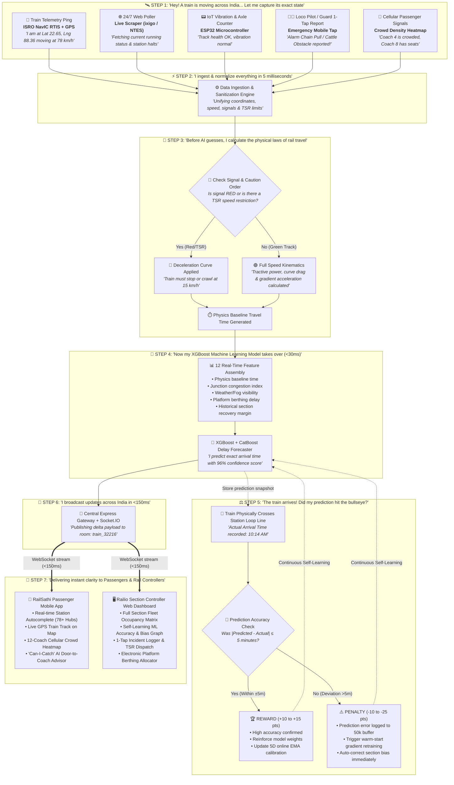

# 🚄 Railio & RailSathi: Self-Narrating Implementation Flowchart

```mermaid
flowchart TD
    %% ─────────────────────────────────────────────────────────────
    %% STAGE 1: REAL-WORLD GROUND-TRUTH TELEMETRY
    %% ─────────────────────────────────────────────────────────────
    subgraph STAGE1 ["🛰️ STEP 1: 'Hey! A train is moving across India... Let me capture its exact state'"]
        T1["🚆 Train Telemetry Ping<br/><b>ISRO NavIC RTIS + GPS</b><br/><i>'I am at Lat 22.65, Lng 88.36 moving at 78 km/h'</i>"]
        T2["🌐 24/7 Web Poller<br/><b>Live Scraper (ixigo / NTES)</b><br/><i>'Fetching current running status & station halts'</i>"]
        T3["📟 IoT Vibration & Axle Counter<br/><b>ESP32 Microcontroller</b><br/><i>'Track health OK, vibration normal'</i>"]
        T4["👨‍✈️ Loco Pilot / Guard 1-Tap Report<br/><b>Emergency Mobile Tap</b><br/><i>'Alarm Chain Pull / Cattle Obstacle reported!'</i>"]
        T5["📱 Cellular Passenger Signals<br/><b>Crowd Density Heatmap</b><br/><i>'Coach 4 is crowded, Coach 8 has seats'</i>"]
    end

    %% ─────────────────────────────────────────────────────────────
    %% STAGE 2: INGESTION & DATA SANITIZATION
    %% ─────────────────────────────────────────────────────────────
    subgraph STAGE2 ["⚡ STEP 2: 'I ingest & normalize everything in 5 milliseconds'"]
        NORM["⚙️ Data Ingestion & Sanitization Engine<br/><i>'Unifying coordinates, speed, signals & TSR limits'</i>"]
    end

    %% ─────────────────────────────────────────────────────────────
    %% STAGE 3: HYBRID PHYSICS KINEMATICS ENGINE
    %% ─────────────────────────────────────────────────────────────
    subgraph STAGE3 ["📐 STEP 3: 'Before AI guesses, I calculate the physical laws of rail travel'"]
        PHY1{"🚦 Check Signal & Caution Order<br/><i>Is signal RED or is there a TSR speed restriction?</i>"}
        PHY_STOP["🛑 Deceleration Curve Applied<br/><i>'Train must stop or crawl at 15 km/h'</i>"]
        PHY_CLEAR["🟢 Full Speed Kinematics<br/><i>'Tractive power, curve drag & gradient acceleration calculated'</i>"]
        PHY_BASE["⏱️ Physics Baseline Travel Time Generated"]
    end

    %% ─────────────────────────────────────────────────────────────
    %% STAGE 4: AI & MACHINE LEARNING INFERENCE
    %% ─────────────────────────────────────────────────────────────
    subgraph STAGE4 ["🧠 STEP 4: 'Now my XGBoost Machine Learning Model takes over (<30ms)'"]
        ML_IN["📊 12 Real-Time Feature Assembly<br/>• Physics baseline time<br/>• Junction congestion index<br/>• Weather/Fog visibility<br/>• Platform berthing delay<br/>• Historical section recovery margin"]
        ML_PRED["🌲 XGBoost + CatBoost Delay Forecaster<br/><i>'I predict exact arrival time with 96% confidence score'</i>"]
    end

    %% ─────────────────────────────────────────────────────────────
    %% STAGE 5: REAL-TIME SELF-LEARNING & FEEDBACK LOOP
    %% ─────────────────────────────────────────────────────────────
    subgraph STAGE5 ["⚖️ STEP 5: 'The train arrives! Did my prediction hit the bullseye?'"]
        ARRIVE["🏁 Train Physically Crosses Station Loop Line<br/><i>'Actual Arrival Time recorded: 10:14 AM'</i>"]
        EVAL{"🎯 Prediction Accuracy Check<br/><i>Was |Predicted - Actual| ≤ 5 minutes?</i>"}
        REWARD["🏆 REWARD (+10 to +15 pts)<br/>• High accuracy confirmed<br/>• Reinforce model weights<br/>• Update 5D online EMA calibration"]
        PENALTY["⚠️ PENALTY (-10 to -25 pts)<br/>• Prediction error logged to 50k buffer<br/>• Trigger warm-start gradient retraining<br/>• Auto-correct section bias immediately"]
    end

    %% ─────────────────────────────────────────────────────────────
    %% STAGE 6: SUB-SECOND WEBSOCKET BROADCAST
    %% ─────────────────────────────────────────────────────────────
    subgraph STAGE6 ["📡 STEP 6: 'I broadcast updates across India in <150ms'"]
        GATEWAY["🔌 Central Express Gateway + Socket.IO<br/><i>'Publishing delta payload to room: train_32216'</i>"]
    end

    %% ─────────────────────────────────────────────────────────────
    %% STAGE 7: CLIENT EXPERIENCE (PASSENGERS & CONTROLLERS)
    %% ─────────────────────────────────────────────────────────────
    subgraph STAGE7 ["📱 STEP 7: 'Delivering instant clarity to Passengers & Rail Controllers'"]
        APP["📱 RailSathi Passenger Mobile App<br/>• Real-time Station Autocomplete (78+ Hubs)<br/>• Live GPS Train Track on Map<br/>• 12-Coach Cellular Crowd Heatmap<br/>• 'Can-I-Catch' AI Door-to-Coach Advisor"]
        DASH["🖥️ Railio Section Controller Web Dashboard<br/>• Full Section Fleet Occupancy Matrix<br/>• Self-Learning ML Accuracy & Bias Graph<br/>• 1-Tap Incident Logger & TSR Dispatch<br/>• Electronic Platform Berthing Allocator"]
    end

    %% ─────────────────────────────────────────────────────────────
    %% FLOW ARROWS & DATA CONNECTIONS
    %% ─────────────────────────────────────────────────────────────
    T1 & T2 & T3 & T4 & T5 --> NORM
    NORM --> PHY1
    PHY1 -- "Yes (Red/TSR)" --> PHY_STOP --> PHY_BASE
    PHY1 -- "No (Green Track)" --> PHY_CLEAR --> PHY_BASE
    PHY_BASE --> ML_IN
    ML_IN --> ML_PRED
    ML_PRED --> GATEWAY
    ML_PRED -.->|"Store prediction snapshot"| ARRIVE
    ARRIVE --> EVAL
    EVAL -- "Yes (Within ±5m)" --> REWARD
    EVAL -- "No (Deviation >5m)" --> PENALTY
    REWARD & PENALTY -.->|"Continuous Self-Learning"| ML_PRED
    GATEWAY ==>|"WebSocket stream (<150ms)"| APP
    GATEWAY ==>|"WebSocket stream (<150ms)"| DASH
```
